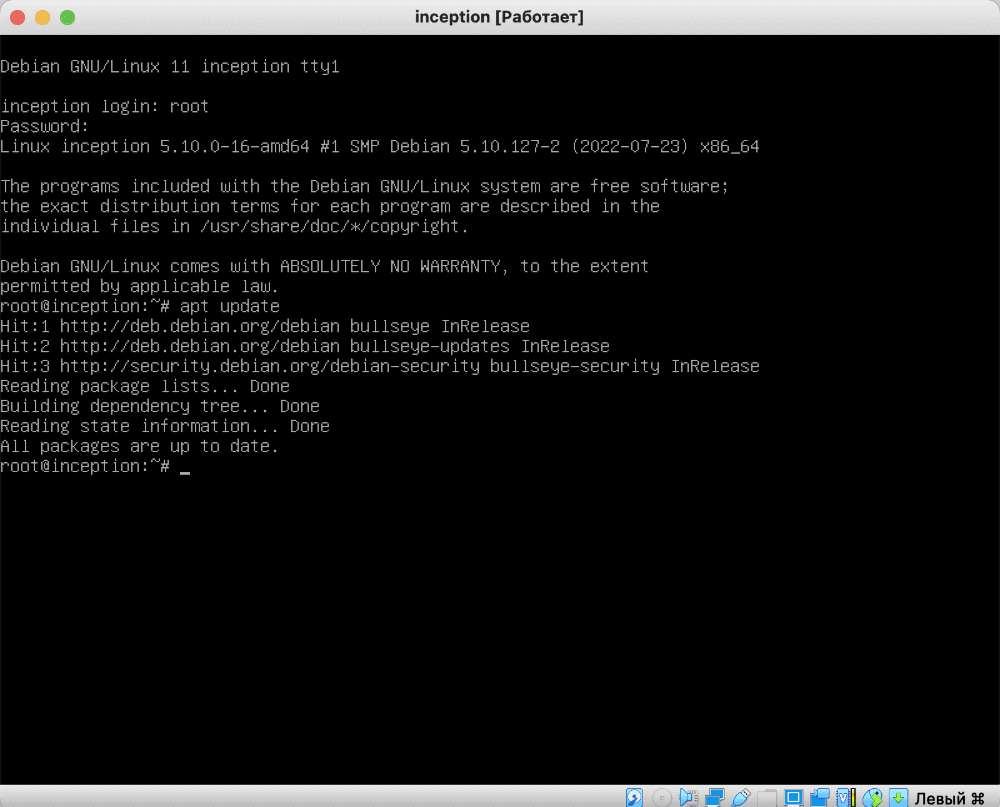
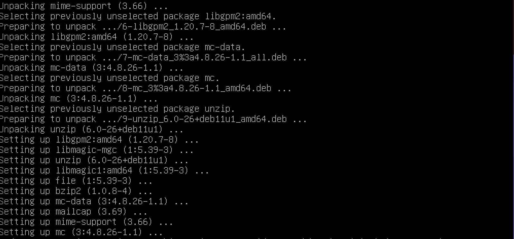

# Installing the necessary software in Debian

### Step 1. Getting to root or superuser

Depending on the OS image you installed, you may have many packages already installed along with the system, but usually for a VM we will be using a light and basic OS, so the first thing we need to do is to install some packages that will be necessary -or at least, very useful- later on.

Probably at this point we won't even have the `sudo` package, so it will be easier to do this first installations with root user.

> You can get to root user using the command `su root`

### Step 2. Updating the repository lists

Update the repositories with the `apt update` command:



### Step 3. Installing Applications

Once these two steps are done, we will install the applications we need with the following command:

```apt install -y sudo ufw openssh-server docker docker-compose make vim firefox-esr wget curl libnss3-tools```

We will enter this command manually, since it is impossible to copy-paste into a virtual machine -well, not really impossible, but that is a feature we haven't set yet-. Later on, we will configure the ssh remote service to be able to connect from VSCode, host terminal, etc.

When installing, we will see output like this:



It means that we did everything right. At the end of the installation, we will see the console output again.

### Step 3.1. Updating PATH in env variables

In some cases, depending on the OS image you installed, you may need to update your PATH env variable to correctly "find" some commands, to do so:

- Open your shell's configuration file in any text editor or using vim/nano. If your shell is bash open `~/.bashrc` , if your shell is zsh open `~/.zshrc`. (Note that `~` refers to your home directory).

- Add line `export PATH="$PATH:/usr/sbin"` . The path `/usr/sbin` is just the most common example, but your location might be different. (If so, try to navigate through your directories until you find sbin folder, which will contain folders and files relative to terminal commands - ls, cat..)

- Save the file, exit and run `source ~/.zshrc` or `source ~/.bashrc` to make the current terminal to "notice" the changes.
