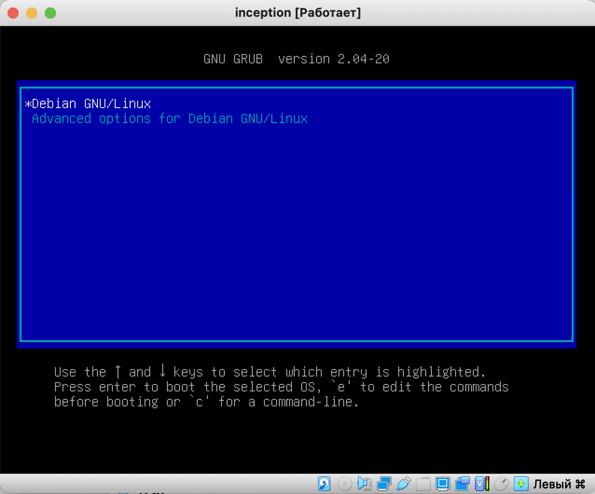

# Installing the necessary software in Debian

### About this step

As said before, this guide uses a Debian system without integrated GUI; if you chose a OS that do have GUI by default, some of the following steps will not be needed.

### Step 1. Login to the system

After installation and the first download, we will be asked to choose our system.:



We will boot under superuser by entering the root username and password.

> ! When you enter the password, the password itself will not be displayed on the screen. This is normal and done for security purposes.


### Step 2. Updating the repository lists

Update the repositories with the `apt update` command:


### Step 3. Installing Applications

After that, we will install the applications we need with the following command:

```apt install -y sudo ufw openssh-server docker docker-compose make openbox xinit kitty firefox-esr```

We will enter this command manually, since it is impossible to copy-paste into a virtual machine. Later, we will open the ports and connect to the VM via the console, as to a local server.

In the meantime, we may make a mistake when entering this command.:


And in this case, the system will tell us the name of the package/packages in the name of which we made a mistake.:


Fix the package name and run the installation.:


When installing, we will see output like this:


It means that we did everything right. At the end of the installation, we will see the console output again.

Now let's check the software we have installed. First, let's launch the openbox graphical environment.

The x-server is responsible for graphics in linux. We run it with the command ``startx``

We will see a black screen. Don't despair, everything is working!

If we hover over this black square and right-click on it, we will see a pop-up menu for launching applications. This is how the lightweight openbox environment works. Let's run the command prompt inside our GUI:


Now we have the opportunity to work either through the GUI terminal or through the TTY terminal.

Let's launch our web browser to check its operation. To do this, select the second item `Web Browser` in the application launcher menu.:


The ObConf utility (the fourth item) will help in the configuration of our GUI, which will allow you to change the theme or set the wallpaper.

So, we've checked all the software we need. Now we can exit the GUI by selecting the last menu item ``Exit``


So, we've made the necessary settings.