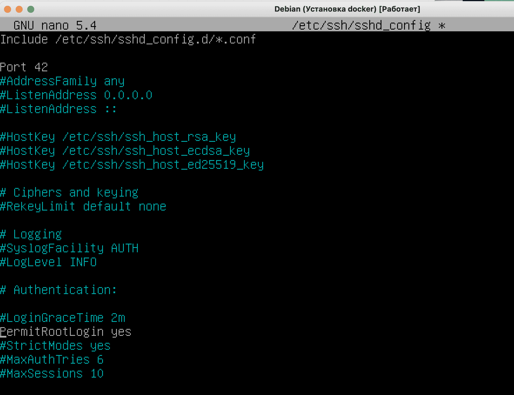
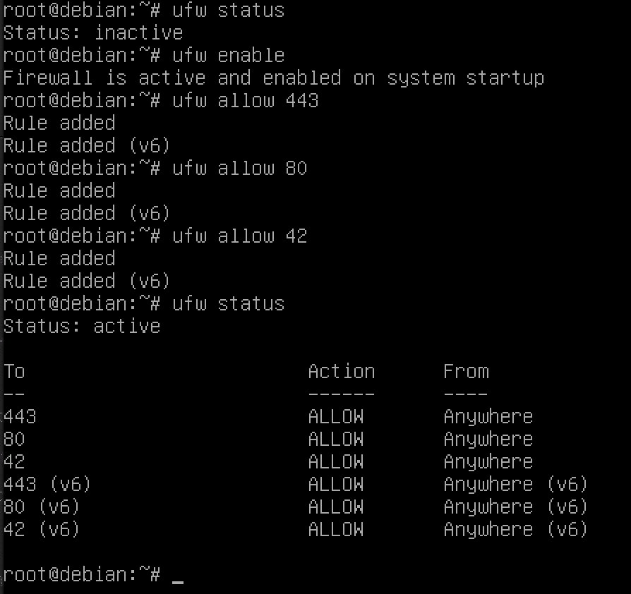
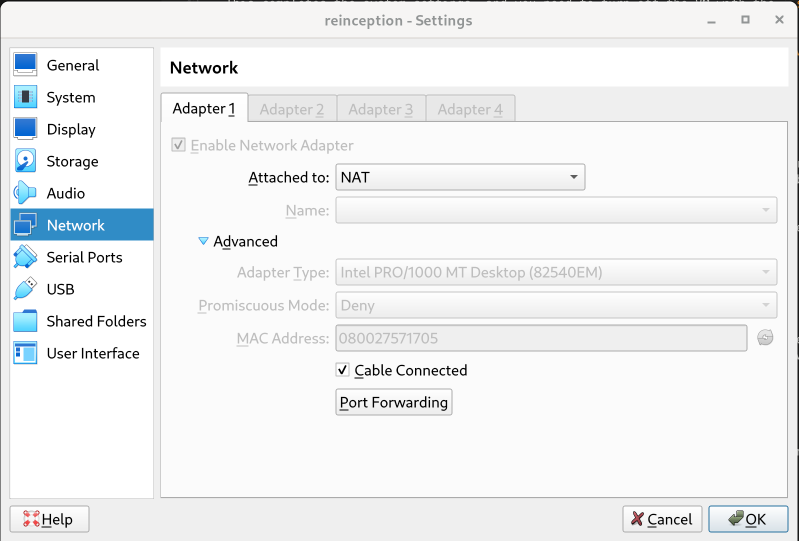
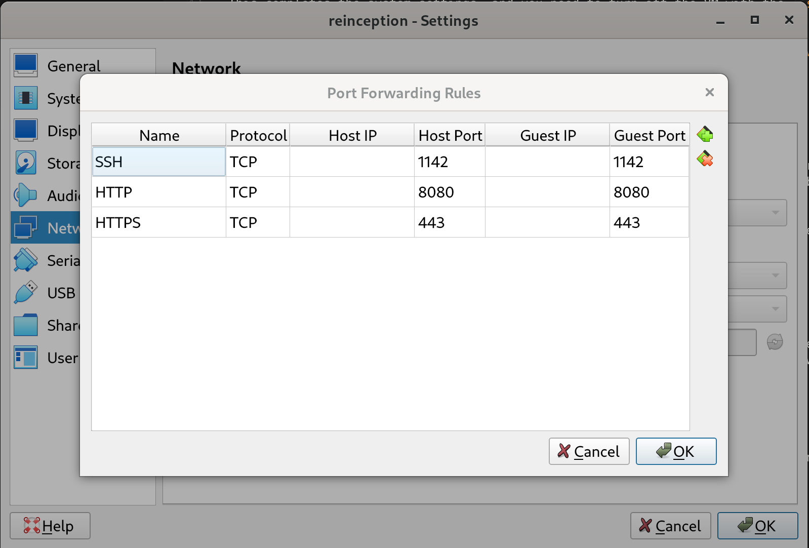
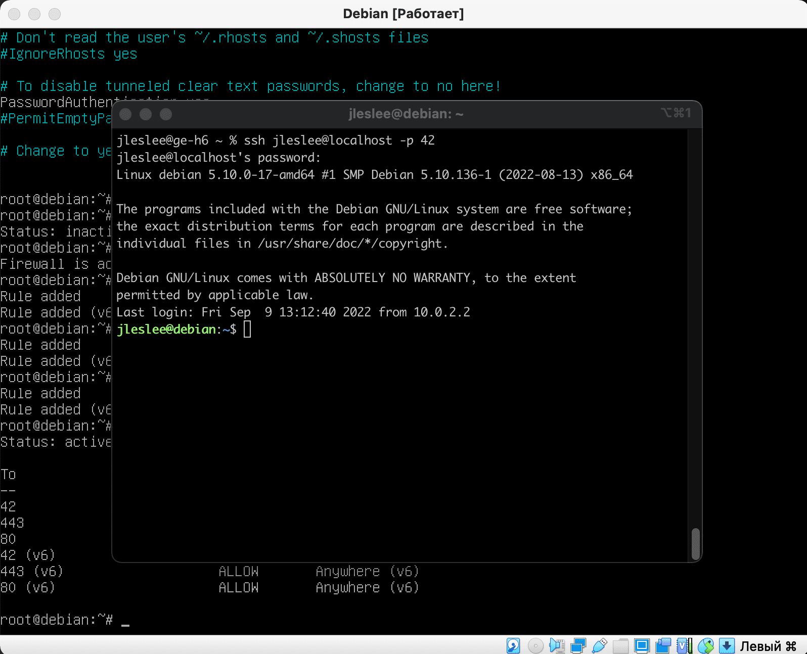

# Port forwarding in the virtual system

As we did for B2BR project, we need to map (portforward) some ports between host and VM. According to the subject, we just need to have port 443 por website https protocol, but I will also allow another port for ssh connection, you can skip that if you want, but I do think it is quite convenient to have remote connection, especially via VSCode.

## Step 1. Setting SSH Configuration

First, let's modify sshd_config file, to set the configuration of remote connection of our system on the virtual machine.

Run ``sudo vim /etc/ssh/sshd_config``

We can use any port we want for the ssh communication, but remember that it has to be an available port. 

> In 42Málaga, ports 42 and 22 are currently occupied. Then, do not follow the example in the following images and use a port of your choosing, in my case, I will use 1142.

Allow logging in under the superuser:



We disable the login with the key (generally optional, but I did) and confirm the login with the password:


After that, we save the configuration and restart ssh and sshd services (in general, sshd is enough, but we get into the habit of doing both to be sure):

```
service ssh restart
service sshd restart
```


## Step 2. Configuring the Firewall

In the `system installation` step, we have already installed the ufw firewall..

Next, we need to open our port 1142 for ssh in the firewall, as well as port 443 for the website -443 port is mandatory by subject-.

First, we launch our firewall with the command ``ufw enable``, then we allow each port with the command ``ufw allow N`', where N is the port number:

> Again, do not follow the ports in the images, they are just examples, but we need to use only 443 and the one you chose for ssh connection



Open ports can be viewed using the `ufw status` command

This completes the system settings, and you need to turn off the VM with the ``shutdown now`` command.

The `shutdown` command will shut down the server in a minute, so we use `shutdown now` for instant termination.:


## Step 3. Port forwarding

It's not enough to open ports on the guest machine, you also need to redirect traffic from the host machine to the guest machine. Traffic traveling on certain ports must be redirected by forwarding ports from the guest machine to the host machine.

In Virtualbox, go to *setting/network/advanced/port forwarding*, and specify the following rule HTPPS and SSH (*ignore HTTP and remember not to use ports 42 or 22 if you are in Malaga campus*):





## Step 4. Login via the terminal of the host OS

First, you need to make sure that there are no local entries on the host machine (the 'physical' PC or MAC you usally work on, not the virtual machine) in ~/.ssh/known_hosts (starting with [localhost]). If there are such lines and there will be problems logging in, then they will need to be deleted.

After we have tried the ports, we need to restart the VM.

You do not need to log in, you can minimize the window of the virtual machine and log in to our server via the terminal.

To log in as a superuser:

```ssh root@localhost -p <port_number>```

To log in as a regular user, we use the username we created.:

```ssh <your_nickname>@localhost -p <port_number>```

Click yes to accept the settings in known_hosts, enter our password and we are in!



Alternatively, we could also use the extension **Remote - SSH** on VSCode, which login process from command palette is quite similar and intuitive. You could just launch the VM, go to VSCode in you host machine (your everyday laptop or 42 machine) and connect to the the VM with this extension. That way, you will have access to the whole VM directories and files, you can add, delete, edit... use the editor terminal, and most important, do all the work in VSCode ^_^
