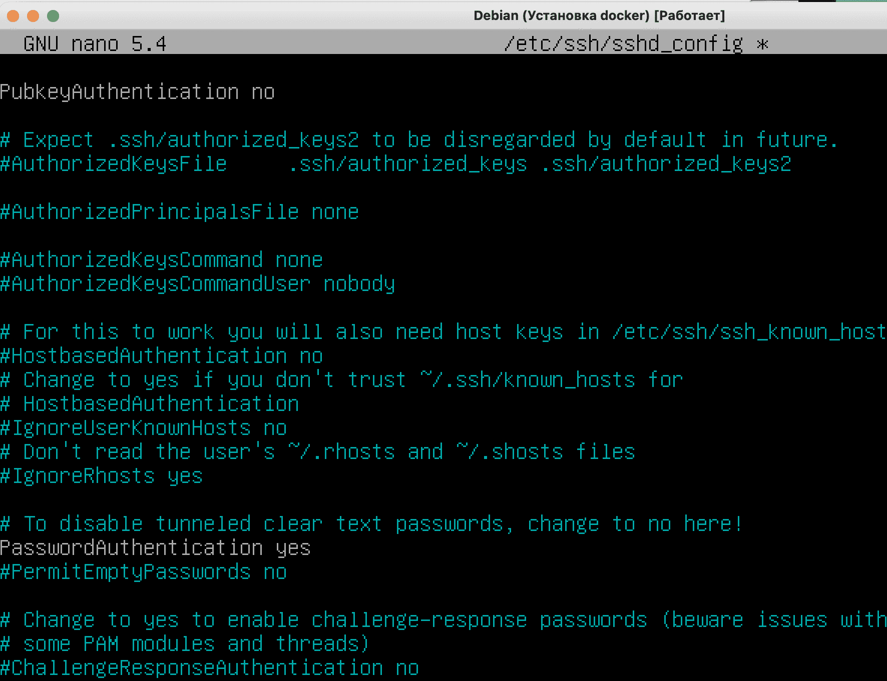
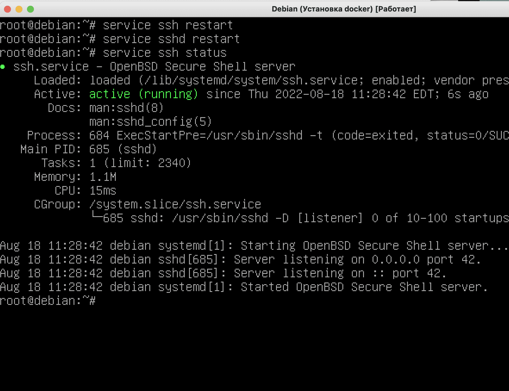
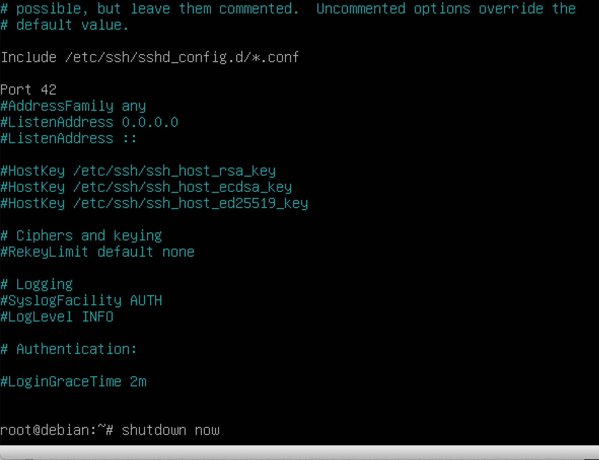

# Port forwarding in the virtual system

## Step 1. Setting ssh Configuration

Log in as superuser and open the file ``/etc/ssh/sshd_config``


All that happens next is unsafe settings for the virtual guest system, do not repeat on vps servers!

Following most guides, now we would change the port to 42. But in 42Málaga, ports 42 and 22 are currently occupied. Then, ignore what you see in the following image and use a port of your choosing, in my case, I will use 43. Allow logging in under the superuser


We disable the login with the key (generally optional, but I did) and confirm the login with the password.:



After that, we save the configuration and restart ssh and sshd services (in general, sshd is enough, but we get into the habit of doing both to be sure):



## Step 2. Configuring the Firewall

In the `system installation` step, we have already installed the ufw firewall..

Next, we need to open our port 43 for ssh in the firewall, as well as ports 80 and 443 for the website.

First, we launch our firewall with the command ``ufw enable``, then we allow each port with the command ``ufw allow N`', where N is the port number:


Open ports can be viewed using the `ufw status` command

This completes the system settings, and you need to turn off the VM with the ``shutdown now`` command.

The `shutdown` command will shut down the server in a minute, so we use `shutdown now` for instant termination.:



## Step 3. Port forwarding

It's not enough to open ports on the guest machine, you also need to redirect traffic from the host machine to the guest machine. Traffic traveling on certain ports must be redirected by forwarding ports from the guest machine to the host machine.

In Virtualbox, go to settings -> network -> advanced -> port forwarding, and specify the following rules (change 42 port for the one you chose before):


## Step 4. Login via the terminal of the host OS

First, you need to make sure that there are no local entries on the host machine (the 'physical' PC or MAC you usally work on, not the virtual machine) in ~/.ssh/known_hosts (starting with [localhost]). If there are such lines and there will be problems logging in, then they will need to be deleted.

After we have tried the ports, we need to restart the VM.

You do not need to log in, you can minimize the window of the virtual machine and log in to our server via the terminal.

To log in as a superuser:

```ssh root@localhost -p <port_number>```

To log in as a regular user, we use the username we created.:

```ssh <your_nickname>@localhost -p <port_number>```

Click yes to accept the settings in known_hosts, enter our password and voila - we are in!


Alternatively, we could also use the extension SSHRemote on VSCode, which process log in is quite similar and intuitive.
