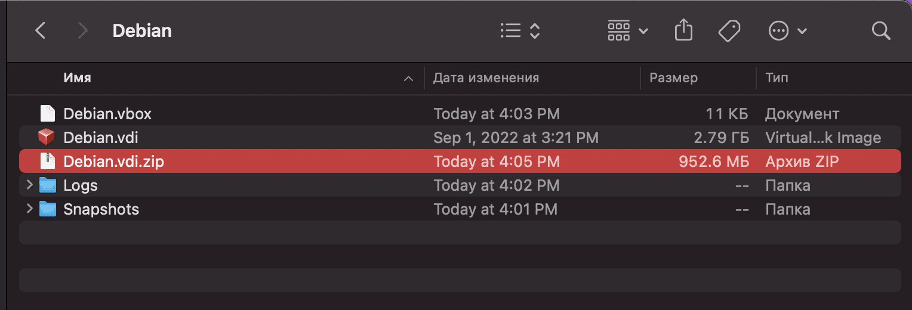
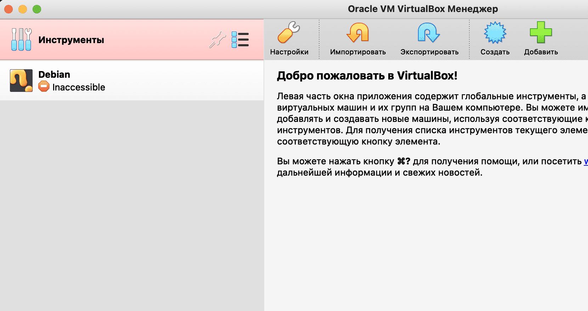
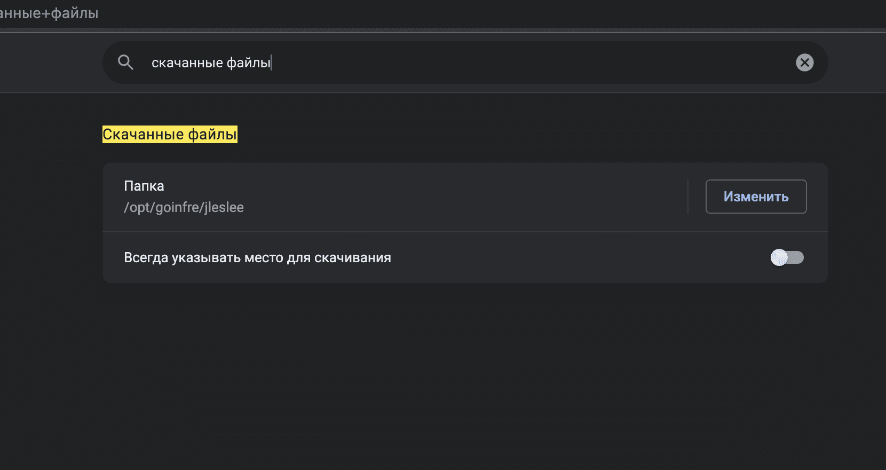
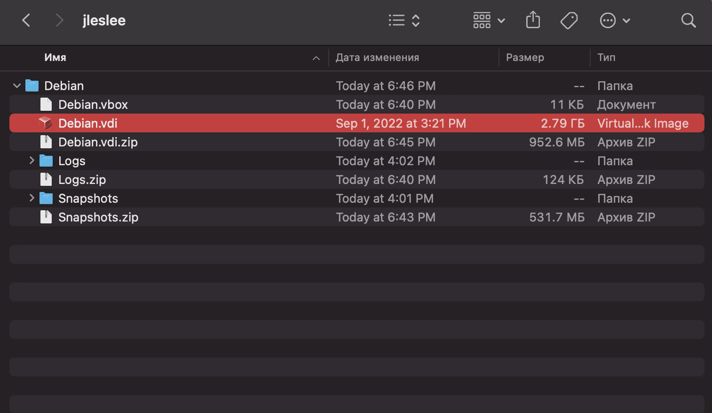

# Project storing and portability

When working on a project, there may be a need to transfer the configuration to another computer. This may seem silly when you can do everything with the same PC and do not worry. But if that is not the case, the portability of the project becomes a very useful feature.

For this project, you could use your phone, USB stick, SSD, or cloud. Any alternative realted to use an external memory it would be as easy as copy and paste all needed files into it. In case you want or need to use an alternative way, here we will see how to store the project on the cloud.

No matter the method you use to keep your files save, something you do need to learn is how to create snapshots of the system state, and save the system with them. Let's start with that.

## Step 1. Learn how to create snapshots

A snapshot is like a photograph of the system status; it's like saving in a videogame. Just as in a game you should not move to the next boss fight without saving, in the inception project you should not do rush actions without snapshots. If something goes wrong, the system can be rolled back to the previous snapshot.

> Attention! The virtual machine must be turned off to create the snapshot!

Go to virtualbox and go to the "snapshots" menu.

From above, click on the green plus sign with the inscription "make" and describe our changes.

This way we get a snapshot of our current changes.:

If something goes wrong, it will not be necessary to delete and redo the configuration, you can simply roll back to the previous working configuration.

## Step 2. Find the installed configuration

Go to the folder on goinfre where our configuration is stored. If we look at the file sizes, we will find that the disk .A vhd weighs more than 2 gigabytes (in my case, almost three gigs), and most modern cloud storage does not support files larger than two gigabytes.

## Step 3. Compress large files

There is a way out! ~~It is necessary to compress the file through the input .vhd and folders. Now our disk weighs 950 megabytes instead of 3 gigabytes!

## Step 4. Upload files to the cloud

This configuration weighs only 1.38 GB with snapshots. Now it can be downloaded and deployed on any school mac and even on a home PC.

For the subsequent transfer, you will need to make a new snapshot after all the saved changes, compress the files and upload them to the cloud again.

## Step 5. Running the configuration on another school mac

> (!) This step is no longer needed in 42Málaga, as we don't use MacOS anymore, plus we do store our large files or projects in sgoingfre, but I will keep the info here just in case it can be useful for other students or in different cases

If we log in to another computer, we regret to find that there is nothing from goinfree on it, and our configuration is missing.:

To save files, we will most likely have to slightly change the browser settings.:

We download our configuration from the cloud to goinfree and create a folder that is named the same as the folder of our previous configuration at the previous location:

Let's unzip all our archives and get the following:

Go to virtualbox and see that our configuration is working.:

And for deployment on a home PC/On the laptop, we will need to download and unzip the configuration, and then in the virtualbox "Tools" tab, click on the green "Add" icon, specifying the folder with the Debian file.vbox and other files.