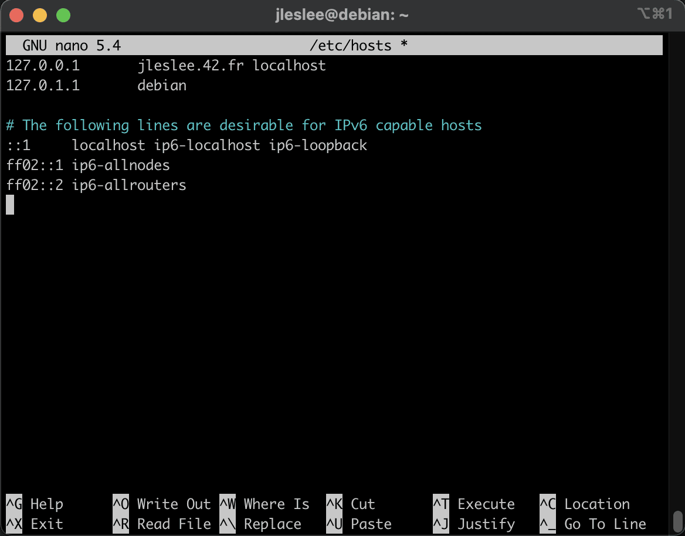
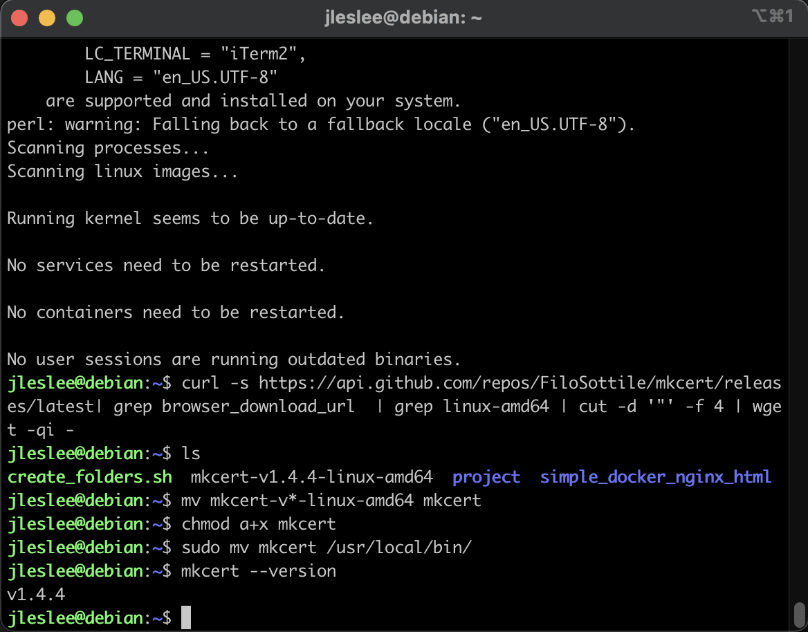

# Changing the local domain and installing certificates

According to the assignment, we need to install a self-signed ssl certificate and work on port 443, as well as change our domain name to username.42.fr. Let's see first how to change the domain name as it is quite simple.

## Step 1. Change the local domain

We need to change the alias of our local domain (127.0.0.1) to the one we need. nickname.42.fr

Open the /etc/hosts file:

```sudo nano /etc/hosts```

And add to the ``localhost`` our login.42.fr in my case it is ``pgomez-r.42.fr ``:



## Step 2. Installing and setting the certificate

Self-signed certificates are usually used for local development. And to generate them it is very convenient to use the mkcert utility, which we will see in a minute.

These certificates will be needed by nginx server later, to "use" them in our website. So basically what we need is to have these certificates stored and availabe in a directory where ngnix can find them.

To achieve this, there are several ways. Let's see first how to generate them directly at our VM so we can pass them to the nginx docker image when needed, although this is not the final method we'll be using, but I think is a good idea to take a look at both so you can choose the one it suits you better at the end. 

> This way is totally valid, you won't need to store them in your git repository -remember, you have to keep senstive info away from it- but as we have to develop and do all evaluation process on our VM, it is ok to have them there.

### Installing mkcert

Downloading the mkcert binary:

```curl -s https://api.github.com/repos/FiloSottile/mkcert/releases/latest| grep browser_download_url  | grep linux-amd64 | cut -d '"' -f 4 | wget -qi -```

Renaming the uploaded file:

```mv mkcert-v*-linux-amd64 mkcert```

We allow all users to execute the file:

```chmod a+x mkcert```

Finally, we move mkcert to the working directory.:

```sudo mv mkcert /usr/local/bin/```

We check that everything is working by requesting the mkcert version.:

```mkcert --version```

We will see something like:



### Getting the certificate

Now we have to get our self-signed certificate and tostore the certificate and key in some directory at your virtual machine system, for instance:

`cd ~/certs/inception/`

To generate a certificate, we use our mkcert; we will use or intra user name as the name for the certificate 

`mkcert <your_nickname>.42.fr`


As you can see, our certificate has been valid for more than two years, and that's a good thing.

The only thing we need to do is to change the file extensions so that nginx server reads them correctly. We use mv, not forgetting to change <your_nickname> to your nickname:

`mv <your_nickname>.42.fr-key.pem <your_nickname>.42.fr.key`

`mv <your_nickname>.42.fr.pem <your_nickname>.42.fr.crt`

And as a result, we have a key with a certificate of the formats we need, which we will use later when writting our nginx docker image, with which we could also test that both certificate and localhost new 'link' (our 42user as domain) are working correctly, but do not worry about it much for now and let's move on to creating a basic Makefile.
