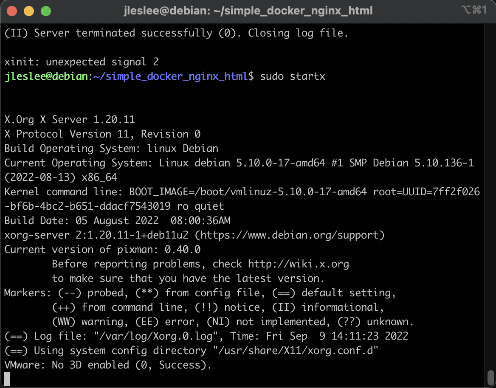
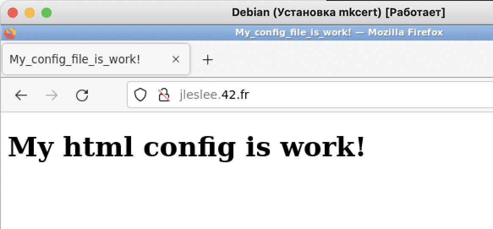
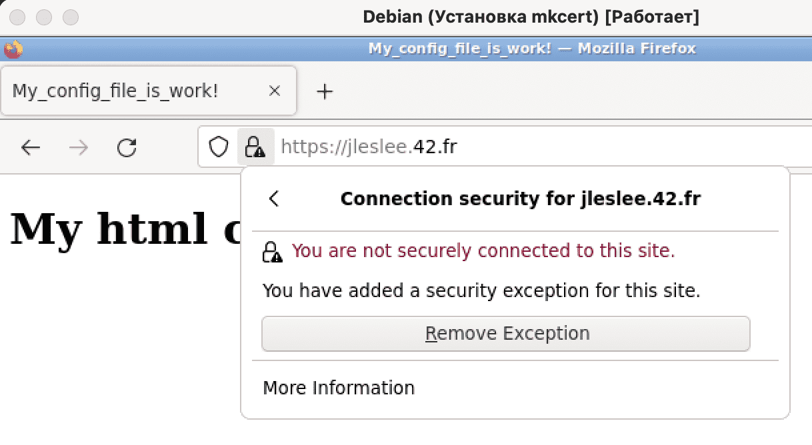
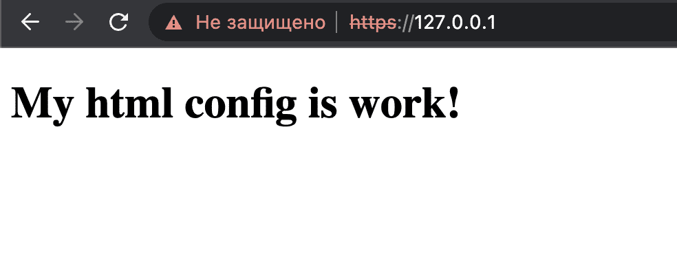

# Changing the local domain and installing certificates

## Step 1. Install mkcert

According to the assignment, we need to install a self-signed ssl certificate and work on port 443, as well as change our domain name to username.42.fr . Let's start with a self-signed certificate - SSL.


Self-signed certificates are usually used for local development. And to generate a self-signed certificate, it is very convenient to use the mkcert utility.

Update the list of repositories:

```sudo apt update -y```

Install utilities that will help us download mkcert.:

```sudo apt install -y wget curl libnss3-tools```

Downloading the mkcert binary:

```curl -s https://api.github.com/repos/FiloSottile/mkcert/releases/latest| grep browser_download_url  | grep linux-amd64 | cut -d '"' -f 4 | wget -qi -```

Renaming the uploaded file:

```mv mkcert-v*-linux-amd64 mkcert```

We allow all users to execute the file:

```chmod a+x mkcert```

Finally, we move mkcert to the working directory.:

```sudo mv mkcert /usr/local/bin/```

We check that everything is working by requesting the mkcert version.:

```mkcert --version```

We see the following conclusion:


## Step 2. Change the local domain

Next, we need to change the alias of our local domain (127.0.0.1) to the one we need. nickname.42.fr . Open the /etc/hosts file:

```sudo nano /etc/hosts```

And add to the ``localhost`` our login.42.fr in my case it is ``pgomez-r.42.fr ``:


To test the domain, we can run our test container again.:

```cd ~/simple_docker_nginx_html/ && docker-compose up -d```

Now run the following command:

```sudo startx```

This command is to launch the x-server, which is necessary for rendering the graphical environment (GUI). We will see the following conclusion:



> As we can see from these logs, our graphics have successfully started, but we will see the GUI only in the virtualbox window, not in the terminal connected via ssh. This is how xserver works, popularly called "xsi" - if it is running in a terminal, you need to open the system window in virtualbox and work in it. It's even easier to log in and run graphics with a browser in virtualbox, and execute commands in the terminal.

Let's go to our graphical environment in the virtualbox window. Turning on the web browser, we type in the http address://<your_nickname>.42.fr/ replacing <your_nickname> with our nickname. The result should be as follows:



As we can see, we have a local domain, but there is no certificate.

## Step 3. Getting the certificate

Let's go to the terminal again. Now we have to get our self-signed certificate.

Let's put the certificate and key in the project/srcs/requirements/tools/ folder. Let's go there first:

```cd ~/project/srcs/requirements/tools/```

To get a certificate, we use our mkcert. That's how I'll generate a certificate for my <your_nickname>.42.fr domain.: 

```mkcert <your_nickname>.42.fr```

The following happened:


As you can see, our certificate has been valid for more than two years, and that's a good thing.

The only thing we need to do is to change the file extensions so that the nginx server reads them correctly. We use mv, not forgetting to change <your_nickname> to your nickname:

```mv <your_nickname>.42.fr-key.pem <your_nickname>.42.fr.key```

```mv <your_nickname>.42.fr.pem <your_nickname>.42.fr.crt```

And as a result, we have a key with a certificate of the formats we need.

## Step 4. Reconfiguring the container for https

Now we need to change the nginx and test project settings to test https operation.

Let's change the settings of the nginx config, which is located at ~/simple_docker_nginx_html/nginx/conf.d/nginx.conf:

```nano ~/simple_docker_nginx_html/nginx/conf.d/nginx.conf```

Erase the entire contents of the file and copy the following code there:

```
server {
    # Listening to the http port
    listen      80;
    # Listening to the https - ssl port
    listen      443 ssl;
    # Setting the domain on which we will work:
    server_name  <your_nickname>.42.fr www.<your_nickname>.42.fr;
    # Specify the root directory of the project:
    root    /var/www/public/html;
    # The following section is commented out for
# normal operation from the host machine.
    # We redirect from http to https:
    #if ($scheme = 'http') {
    #    return 301 https://<your_nickname>.42.fr$request_uri;
    #}
    # Specify the path to the certificate and key:
    ssl_certificate     /etc/nginx/ssl/<your_nickname>.42.fr.crt;
    ssl_certificate_key /etc/nginx/ssl/<your_nickname>.42.fr.key;
    # Specify the supported tls protocols:
    ssl_protocols            TLSv1.2 TLSv1.3;
# We specify caching options and timeouts:
    ssl_session_timeout 10m;
    keepalive_timeout 70;
    # We tell the server which file extension to use
    # we need to search in our root folder (root)
    location / {
        try_files $uri /index.html;
    }
}
```


> Again (!) Change <your_nickname> to your nickname in five places!

Now we need to go to the test project folder and stop the container.:

```cd ~/simple_docker_nginx_html/ && docker-compose down```

Then we open our docker-compose.yml:

```nano docker-compose.yml```

We are adding another section with our keys to the volumes section.:

``- /home/${USER}/project/srcs/requirements/tools:/etc/nginx/ssl``, where ${USER} is a variable that will substitute the name of our user from the $PATH environment here.

In general, we will make sure that the paths to the certificates are spelled out correctly, as well as open port 443 in the ports section.:

```
version: '3'

services:
  nginx:
    image: nginx:stable-alpine
    volumes:
      - ./public:/var/www/public/
      - ./nginx/conf.d:/etc/nginx/conf.d/
      - /home/${USER}/project/srcs/requirements/tools:/etc/nginx/ssl/
    restart: unless-stopped
    ports:
      - "80:80"
      - "443:443"
    container_name: simple_nginx_html
```


## Step 5. Launching the https project in the GUI

Now let's restart our docker with the command

```docker-compose up -d```

Refresh the browser page and see that the browser, alas, does not trust our self-signed certificate.:


Unfortunately, this is the maximum we can achieve. A self-signed certificate is not trusted, as certificates are issued by special certification authorities. All we can do is click the "Advanced" button, then scroll through the page below and click "Accept the risk and continue":


Now our browser trusts the certificate we created and our website is loaded over ssl. However, the connection is still not considered secure, but this is quite enough for our project.



## Step 6. Launch the https project on the host

On the host machine, our project will be available at ``127.0.0.1`` as long as the redirects section in the nginx config is commented out. If you comment on it, we will be redirected to our 42.fr and the school device doesn't know such a site.
(TODO: I will edit this paragraph for better understanding later)

There will also be complaints about self-signed ssl here. Understand, forgive, press "advanced" -> "go to the website".


We will see the already familiar "insecure" https.:



At this point, we can turn off the container with the command

```docker-compose down```


and move on to creating a Makefile!