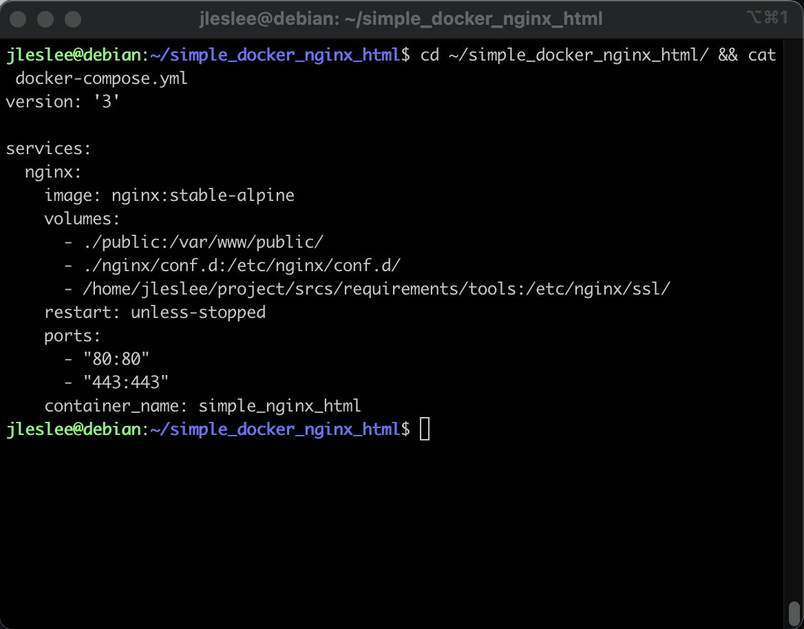

# Creating a Makefile


## Step 1. Find out the name of our container

Being in the project folder, we will print our docker-compose with a cat.:

```cd ~/simple_docker_nginx_html/ && cat docker-compose.yml```



In the ``container_name`` section, we will see the container name: ``simple_nginx_html``. One of the reasons to give containers names is the fact that it will be convenient to refer to them by name.

## Step 2. Setting the variable

Let's create our Makefile in the same directory (~/simple_docker_nginx_html/):

``nano ~/simple_docker_nginx_html/Makefile``

The first variable of our Makefile will be the name variable, to which we will assign the container name.:

```
name = simple_nginx_html
```

In some cases, we will use this, for example, to output logs or to access a specific container by its name.

## Step 3. Running the configuration

The container is launched in docker-compose using the docker-compose up -d command. But the fact is that there are a lot of configurations supported in compose. Programmers and devops engineers often have a separate configuration for development, a separate one for tests, and a third for production.

In our case, there is only one configuration, and you can register our command directly in the Makefile. However, let's be more specific and point docker-compose to our configuration file.:

```@docker-compose -f ./docker-compose.yml up -d```

The dot and slash mean that we are running the file in the same directory where the Makefile is located. The beauty of this approach is that:

a) we can specify another path to the configuration, both relative and absolute

b) we can use different configuration names, for example, test.yml and deploy.yml instead of the canonical name docker-compose.yml

Thus, our all section will look like this:

``
all:
@printf "Running the ${name} configuration...\n"
	@docker-compose -f ./docker-compose.yml up -d
``

## Step 4. Build the configuration

The ``docker-compose up -d --build`` command builds the container. Let's use it to create the next section of the stop in the Makefile, let's call it build:

``
build:
	@printf "Build configuration ${name}...\n"
	@docker-compose -f ./docker-compose.yml up -d --build
``

## Step 5. Stopping the configuration

The ``docker-compose down`` command stops the container. Let's use it to create a stop section in the Makefile, let's call it, for example, down:

``
down:
	@printf "Stopping the configuration of ${name}...\n"
	@docker-compose -f ./docker-compose.yml down
``

## Step 6. Reassembling the configuration

The ``docker-compose up -d --build`` command is responsible for reassembling containers and applying changes. With this command, we will create the re section responsible for the reassembly.:

``
re:
@printf "Reassembling the configuration of ${name}...\n"
	@docker-compose -f ./docker-compose.yml up -d --build
``

## Step 7. Clearing the configuration

So how do you live without clean and fclean? Of course, these commands are much less useful in docker than in c, and the result of their work is not directly visible. However, if we want to clear the memory, delete unnecessary partitions and docker networks, they will be useful to us.

``docker system prune --a`` is a command that deletes all unused images.

If we only need images of running containers, and all the others are already used, then by executing this command while the containers are running, we clear all unused images.

Creating a clean section:

```
clean: down
	@printf "Clearing the configuration of ${name}...\n"
	@docker system prune -a
```

## Step 8. Deep cleaning of all configurations

Well, we can put a total cleanup on fclean. To clean up all the images that are on the machine, we will first stop all running containers with the command ``docker stop $$(docker ps -qa)`, then forcibly (with the --force flag) delete everything that is bad (and everything that is good too).

Next, we will delete all networks and all connected partitions. Our code will look like this:

``
fclean:
@printf "Complete cleanup of all docker configurations\n"
	@docker stop $$(docker ps -qa)
	@docker system prune --all --force --volumes
	@docker network prune --force
	@docker volume prune --force
``

It's worth doing `make fclean` only when you really want to build the entire make project from scratch.

Thus, our *entire Makefile* consists of the following code:

```
name = simple_nginx_html
all:
@printf "Setting configuration for ${name}...\n"
	@docker-compose -f ./docker-compose.yml up -d

build:
	@printf "Building ${name}...\n"
	@docker-compose -f ./docker-compose.yml up -d --build

down:
	@printf "Stopping ${name}...\n"
	@docker-compose -f ./docker-compose.yml down

re:	down
	@printf "Reassembling ${name} configuration...\n"
	@docker-compose -f ./docker-compose.yml up -d --build

clean: down
	@printf "Clearing the configuration of ${name}...\n"
	@docker system prune -a

fclean:
@printf "Complete cleanup of all docker configurations\n"
	@docker stop $$(docker ps -qa)
	@docker system prune --all --force --volumes
	@docker network prune --force
	@docker volume prune --force

.PHONY	: all build down re clean fclean
```

Let's test this Makefile on our test container and then move on to the combat project!


> And don't forget to take a snapshot and save yourself in a cloud!
