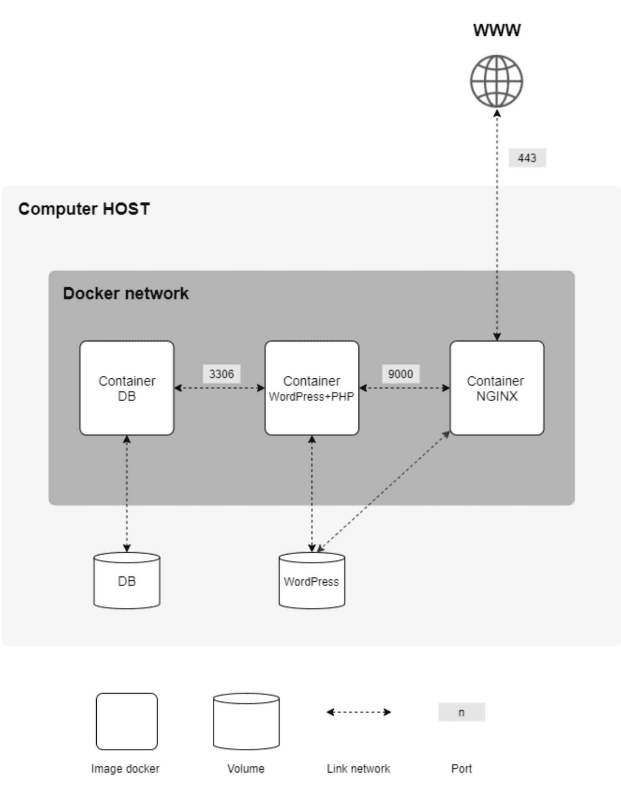

# Projects services and Docker basic concepts 

So we took a snapshot, saved the configuration to the cloud or to a USB stick, and are ready to start deploying containers directly to the project.

First, let's get some knowledge of the technologies that we will use in our containers. The following scheme is given in our assignment:

Let's see what kind of software we need to implement what is shown in the diagram.:

Technology | Purpose | The Creator | Ports
------ | ------ | ------ | ------ | 
Nginx | Proxying web server | Igor Sysoev (Russia) | 443 |
PHP	| Scripting language for the web | Rasmus Lerdorf (Denmark) | - |
Php-Fpm | Set of libraries for FastCGI API | Andrey Nigmatulin (Russia) | 9000 |
Wordpress | Content Management System | Matthew Mullenweg (USA) | - |
MariaDB | Relational database | Mikael Videnius (Finland) | 3306 |
---

- Nginx is a super-efficient traffic director (proxy server) for websites. It’s widely regarded as one of the best tools for handling web requests and forwarding them to the right place (like PHP or a website).

- PHP  is a programming language made specifically for websites created  in 1995; it quickly gained popularity in web development and is still one of the leading languages for the web

- PhP-fpm (stands for 'FastCGI Process Manager') is a library used to communicate smoothly between nginx and php, as they don't natively "understad" each other; php-fpm is sort of a "translator" between the two. It helps Nginx communicate smoothly with PHP, and it comes bundled with PHP in our setup

- WordPress is a user-friendly system for creating and managing websites (often called a CMS—Content Management System). Even if you’re not a developer, you can use it to build professional-looking sites with 'minimal' effort

- MariaDB is a lightweight, high-performance database system, fully compatible with MySQL (another popular database). It’s where WordPress stores all your website’s data (like posts, users, and settings).

## Introduction to Docker

A docker image is a set of environments required to run certain software. It differs from virtualbox-type emulators in that the container does not contain a full operating system, the container uses the Linux kernel and not everything is placed inside it, but only the programs and libraries needed to run the software.

Thus, the container weighs significantly less than an entire emulated system. Let's see this clearly. Let's see how much our OS weighs when installed.:

And let's compare this with the same image of the eleventh debian on DockerHub - the official Docker image repository:

The image weighs only 50 MB in compressed form and, after unpacking, this image will weigh about 150 MB. That's such a significant difference.

That's because you don't need a full operating system to run a separate software, just a working kernel and some environment made up with all the dependencies - modules, libraries, packages, and scripts.

Here you have a nice introduction to Docker made by 42 Málaga former student josesanc https://github.com/josanri/docker-workshop/blob/main/Introducci%C3%B3n%20a%20Docker.pdf -> ***LECTURA MUY RECOMENDABLE*** <-

As josesanc wisely put it on his guide, we can understand Docker basis and how its process works (from "coding" the image, to actually deploy and run it) using two analogies:

### Videogame Installation Analogy

- *Dockerfile* → Like a game installation manual. It contains step-by-step instructions for setting up the game (e.g., "install dependencies," "copy game files").

- *Docker Image* → Like the game disc. It’s a ready-to-use snapshot of the game, built from the manual (Dockerfile). You can duplicate this disc or share it with others.

- *Docker Container* → Like the game running on your console. It’s the actual, playable instance of the game (image), isolated in its own environment.

### Software Program Analogy

- *Dockerfile* → Like writing code for a program. It defines how the software should be built (e.g., libraries to install, files to include).

- *Docker Image* → Like the compiled .exe file. It’s a standalone, executable version of your program, created from the code (Dockerfile).

- *Docker Container* → Like running the .exe. It’s the live, isolated process executing your program (image) on your system.

Having understood this, let’s apply the concepts to our porject logic process. Here’s how the workflow would be for setting each service:

1) Start with a Base OS Image
    We pick a lightweight, pre-made operating system (Alpine/Debian) as our foundation —think of it as a "blank page" for our environment-.

2) Customize the environment on Dockerfile code
    Using the Dockerfile, we define step-by-step actions to set up the service, such as installing software (*RUN apt-get install nginx*), copying files (*COPY configs/ /app*), configuring settings (e.g., editing config files), and so on.

3) Result: A Ready-to-Run Image
    Once built, the Dockerfile produces an image: a frozen, portable snapshot of the environment, perfectly tailored to run our desired service

4) Running Up Containers
    When we run the image, it becomes a container —a live, isolated instance of our service, behaving the same way everywhere.

> In this guide, we will use both OS images allowed by subject: debian and alpine. This way you can see both alternatives and notice its differences. For instance, alpine is considerably lighter that debian, but that also imposes limitations, as it comes with less pre-installed packages (apk instead of apt, sh without bash, etc.). Thus, alpine will be used for optimal size saving when creating docker images, but in our case, we don't really has to worry that much about size. At the same time, we can add many packages as wee need to both systems later on the process of building the docker image, so in summary: choose whichever you want, it will make no significant difference.