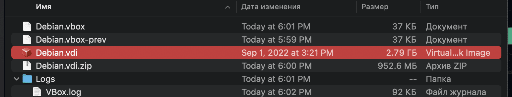

# Creating NIGNX container

So we took a snapshot, saved the configuration to the cloud or to a USB stick, and are ready to start deploying containers directly to the project.

First, let's get some knowledge of the technologies that we will use in our containers.

The following scheme is given in our assignment:


Let's see what kind of software we need to implement what is shown in the diagram.:

Technology | Purpose | The Creator | Ports
------ | ------ | ------ | ------ | 
Nginx | Proxying web server | Igor Sysoev (Russia) | 443 |
PHP	| Scripting language for the web | Rasmus Lerdorf (Denmark) | - |
Php-Fpm | Set of libraries for FastCGI API | Andrey Nigmatulin (Russia) | 9000 |
Wordpress | Content Management System | Matthew Mullenweg (USA) | - |
MariaDB | Relational database | Mikael Videnius (Finland) | 3306 |
---

- Nginx is largely considered to be the best proxying web server.

- PHP was created  in 1995, it quickly gained popularity in web development and is still one of the leading languages for the web.

- The php-fpm library has become the standard API between php and web servers, including Nginx. This is what we will use to make our nginx and php to get along. It is installed in a container with php.

- Wordpress is an easy-to-set up CMS (creation and modification of digital content) system which will help us to design wbesites "easily".

- MariaDB is a lightweight MySQL database analog.


So, let's start configuring the server with Nginx.

## Step 1. Introduction to Docker

A docker image is a set of environments required to run certain software. It differs from virtualbox-type emulators in that the container does not contain a full operating system, the container uses the Linux kernel and not everything is placed inside it, but only the programs and libraries necessary to run the software.

Thus, the container weighs significantly less than the emulated system. Let's see this clearly. Let's see how much our OS weighs when installed.:



And let's compare this with the same image of the eleventh debian on [Docker Hub](https://hub.docker.com / "docker hub") - the official Docker image repository:


The image weighs only 50 MB in compressed form (the compressed Debian disk weighed 950 MB!). After unpacking, this image will weigh about 150 MB. That's such a significant difference. And this is far from the limit.

That's because you don't need a full operating system to run a separate software, just a working kernel and some environment made up with all the dependencies - modules, libraries, packages, and scripts.

We will use the lightweight alpine system, which is used for containers and microcontrollers, but can also be installed in an emulator or on real hardware. The system is extremely light in weight: about 50 megabytes with the core, 30 megabytes unpacked and 2.5 megabytes compressed:


The difference between the compressed format and debian is as much as 20 times! This was achieved by optimizing everything and everything, but it also imposes limitations. So the system uses a lightweight apk instead of the usual apt, there is no full-developed bash, sh is used instead, of course, [its own set of repositories] (https://pkgs.alpinelinux.org/packages "alpine package list") and many other features.

However, as with any open-source linux, a lot can be added here. And it is this distr that has become the main one for many docker projects due to its low weight, high speed and high fault tolerance. The larger and more complex the system, the more points of failure, which means that lightweight distributions have great advantages in this case.

So, when we have finished the review and figured out the difference between virtual machine and containers, we proceed to study how Docker works.

## Step 2. Create a Dockerfile

In Docker, a special file called Dockerfile is responsible for the configuration. It prescribes a set of software that we want to deploy inside this container.

Go to the folder of our nginx:

```cd ~/project/srcs/requirements/nginx/```

Creating a Dockerfile in it:

```nano Dockerfile```

And we write in it the FROM instruction, which indicates from which image we will deploy our container. By subject, we are prohibited from specifying labels like alpine:latest, which are automatically assigned to the latest versions of alpine in the dockerhub repositories. Therefore, we go to the [official website](https://www.alpinelinux.org / "alpine versions") of the system and see which is the latest release. At the time of writing the guide, it was alpine 3.21, but for the FROM instructions, it will be enough to specify the younger version.:

```FROM alpine:3.21```

More information about Dockerfile instructions can be found in [this video](https://www.youtube.com/watch?v=wskg5903K8I "docker by Anton Pavlenko"), here we will analyze just a few of them.

Next, we specify which software and how we want to install it inside the container. The RUN instruction will help us with this.

The `RUN` instruction creates a new image layer with the result of the called command, similar to how the snapshot system saves changes in a virtual machine. Actually, the image itself consists of this kind of layers of changes.

It is not possible to launch the application directly from `RUN`. In some cases, this can be done through a script, but in general, the `CMD` and `ENTRYPOINT" instructions are used to run. 
`RUN` creates a static layer, changes inside which are written to the image, but do not cause anything. 
`CMD` and `ENTRYPOINT` run something, but DO NOT WRITE changes to the image. Therefore, it is not necessary to execute scripts with them.

We can say that the changes made through `RUN` are static. For example, installing packages in a system is usually done like this:

```RUN	apk update && apk upgrade && apk add --no-cache nginx```

Here we tell the apk file manager to update the list of its repositories in search of the latest software versions (apk update), update outdated packages in our environment (apk upgrade) and install nginx without storing the source code in the cache (apk add --no-cache nginx). It works almost exactly like `apt` in debian.

Then we need to open the port where the container will exchange traffic.:

```EXPOSE 443```

Eventually we have to run the installed configuration. To do this, use the instruction ``CMD``:

```CMD ["nginx", "-g", "daemon off;"]```

This way we run nginx directly, rather than in daemon mode. Daemon mode, on the other hand, is a startup mode in which an application starts in the background, or as in Windows equivalence, a service. For the convenience of debugging, we disable this mode and receive all nginx logs directly into the tty(?) of the container.

```
FROM alpine:3.16
RUN	apk update && apk upgrade && apk add --no-cache nginx
EXPOSE 443
CMD ["nginx", "-g", "daemon off;"]
```
That's actually the whole Dockerfile. Simple, isn't it?


Save, close.

## Step 3. Create a configuration file

Naturally, our nginx won't work without a configuration file. Let's write it!

Using `ls` to look at our nginx folder, we will find the conf and tools directories in it. Therefore, our configuration should be in the conf folder if we are normal white people (no racism, just a common phrase).

Let's create our config right from here:

```nano conf/nginx.conf```

Since we have already trained with the test container, we will take a similar configuration, changing it for php so that it allows reading wordpress php files instead of html. We will no longer need port 80, since according to the guide we can only use port 443. But at the first stage, we will comment out the sections responsible for php and temporarily add html support (for verification):
``
server {
    listen      443 ssl;
    server_name  <your_nickname>.42.fr www.<your_nickname>.42.fr;
    root    /var/www/;
    index index.php index.html;
    ssl_certificate     /etc/nginx/ssl/<your_nickname>.42.fr.crt;
    ssl_certificate_key /etc/nginx/ssl/<your_nickname>.42.fr.key;
