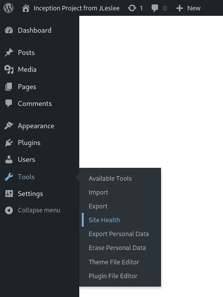
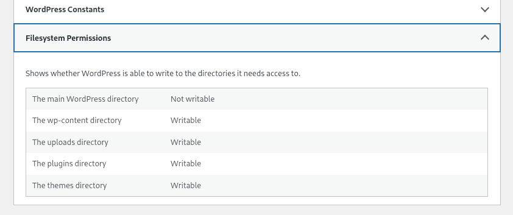

# Redis database for wordpress cache

Let's get to the bonus part of the project. First, let's create a Redis database for caching our wordpress.

But first, let's make beauty out of our default wp, because it's kind of sad to see a poor default theme on your site.

Let's start by checking if we did everything right. Go to tools -> site health:



On the health page, go to the information tab:


Sorry, wrong screen... So, go to the info tab.:


At the very bottom, open the "file system permissions" drop-down list. It should be as shown in the screenshot:



For wordpress core, the entry should be unavailable for security reasons, but it should be available for the rest of the sections.

If suddenly there are no write permissions or something is wrong, as in this screenshot, you can copy the Dockerfile from the wordpress guide again and restart the project. It should work.

Next, we'll install a normal theme. Go to the menu "appearance -> themes":


You can add a new theme using the "Add New" button:


Here we can choose any theme we like. I liked Inspiro:


After installation, the "activate" button will appear in place of the "install" button. We press it and rejoice:


You can also experiment with installing plugins and designing at least the main page of the site. Just for practice. And then start installing Redis.

## Step 1. Install Redis

First, as usual, let's create a Dockerfile for our radish.

If we don't know which folder to start with, we'll choose srcs for ourselves.:

``cd ~/project/srcs``

Next, we will create a folder for bonuses and a directory of bonus projects.:

``mkdir requirements/bonus``

``mkdir requirements/bonus/redis``

``mkdir requirements/bonus/vsftpd``

``mkdir requirements/bonus/adminer``

``mkdir requirements/bonus/website``

``mkdir requirements/bonus/website/conf``

We will create a Dockerfile in the redis directory.:

``nano requirements/bonus/redis/Dockerfile``

We will add the following code to it:

```
FROM alpine:3.16

RUN apk update && apk upgrade && \
    apk add --no-cache redis && \
    sed -i "s|bind 127.0.0.1|#bind 127.0.0.1|g"  /etc/redis.conf && \
    sed -i "s|# maxmemory <bytes>|maxmemory 20mb|g"  /etc/redis.conf && \
    echo "maxmemory-policy allkeys-lru" >> /etc/redis.conf

EXPOSE 6379

CMD [ "redis-server" , "/etc/redis.conf" ]
```

Here we have selected the current version of alpine, installed a radish there and slightly adjusted its configuration. Then they opened the default port and launched the radish server, feeding it a ready-made config. Voila.

## Step 2. Configuring docker-compose

In docker-compose.yml we will add a radish section:

```
  redis:
    build:
      context: .
      dockerfile: requirements/bonus/redis/Dockerfile
    container_name: redis
    ports:
      - "6379:6379"
    networks:
      - inception
    restart: always
```

## Step 3. Launch and check

Restarting the configuration again. Since we don't have any extra configs and we don't need to transfer environment variables, we can go to the project folder and use the Makefile.:

``make re``

After the project is assembled, we will check its operation as follows:

``docker exec -it redis redis-cli``

After this command, we will be surrounded by radishes.:

``127.0.0.1:6379>``

Here we have to enter a simple command:

``ping``

The answer should be like this:

``PONG``

If we have received this response, it means that our server is working and pinging perfectly. Congratulations on this wonderful event!

## Step 4. Installing the WP Redis plugin

We go to wordpress on the plugin search page:


We enter "Redis" in the search and install the found plugin.:


After installation, we need to click "Activate" and our plugin will work.

## Step 4. Checking how Redis works

To check the cache operation, run the following command:

``docker exec -it redis redis-cli monitor``

If the output is OK, then everything is working for us, we can exit the monitor using Ctrl+C. Radish is running, let's disperse!

