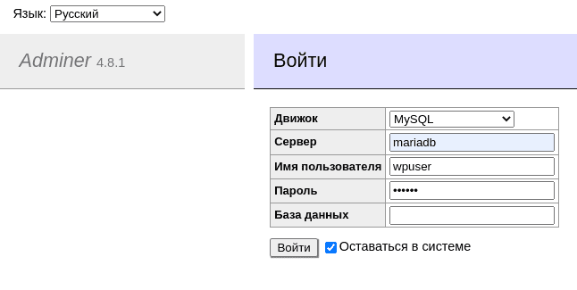

# Adminer administrative interface

Now we need to install the adminer admin panel. In fact, this is a lightweight database that contains just one php file!

Therefore, to deploy it, we need to install the php version we need in the container, download our panel and feed it to the php interpreter. It sounds simple. The main thing is not to forget to open the ports.

Why is it needed at all? In order to be able to open the database in graphical mode and ~~monitor the dummies ~~ do any operations we need in it without SQL queries and manual commands.


Let's go!

# Step 1. Create a Dockerfile

Go to [official adminer website](https://www.adminer.org / "download adminer") and look at the features and dependencies:


As we can see, adminer works with php-8 and supports our Masha. But how do I figure out which packages are needed for adminer as dependencies? I didn't find this information in open sources, so I approached this issue from a different angle.

The equivalent of adminer is phpMyAdmin, and this thing runs on the same php. But unlike Adminer, all phpMyAdmin dependencies are perfectly documented in the [alpine wiki](https://wiki.alpinelinux.org/wiki/PhpMyAdmin "list of packages for PMA"). It was the instructions for PMA that helped me launch adminer: I took all the dependencies from here from the line "Install the additional packages" and ran them through [package search](https://pkgs.alpinelinux.org/packages?name=&branch=edge&repo=&arch=&maintainer = "alpine package search"), substituting our current php8 instead of php7.

php8-mcrypt, php8-xmlrpc and, surprisingly, php8-json were eliminated. The surprise still turned out to be pleasant - if the first two packages simply haven't been implemented yet on alpine, then the json module has been included in the php core since version 8.


I also removed the unnecessary lighttpd and fast cgi. So, the list of packages is formed, let's start creating the Dockerfile.:

``vim requirements/bonus/adminer/Dockerfile``

Let's take the same alpine 3.16 as a basis, add the php version to the variable and install all the packages we need from the ready list.:

```
FROM alpine:3.16

ARG PHP_VERSION=8

RUN apk update && apk upgrade && apk add --no-cache \
    php${PHP_VERSION} \
    php${PHP_VERSION}-common \
    php${PHP_VERSION}-session \
    php${PHP_VERSION}-iconv \
    php${PHP_VERSION}-gd \
    php${PHP_VERSION}-curl \
    php${PHP_VERSION}-xml \
    php${PHP_VERSION}-mysqli \
    php${PHP_VERSION}-imap \
    php${PHP_VERSION}-cgi \
    php${PHP_VERSION}-pdo \
    php${PHP_VERSION}-pdo_mysql \
    php${PHP_VERSION}-soap \
    php${PHP_VERSION}-posix \
    php${PHP_VERSION}-gettext \
    php${PHP_VERSION}-ldap \
    php${PHP_VERSION}-ctype \
    php${PHP_VERSION}-dom \
    php${PHP_VERSION}-simplexml \
    wget

WORKDIR /var/www/html/

RUN wget https://github.com/vrana/adminer/releases/download/v4.8.1/adminer-4.8.1.php && \
    mv adminer-4.8.1.php index.php && chown -R root:root /var/www/html/

EXPOSE 8080

CMD	[ "php", "-S", "[::]:8080", "-t", "/var/www/html" ]
```

As you can see, I make the /var/www/html/ directory my working directory, download adminer to this directory and name it index.php because the interpreter needs to feed a folder, and in the folder it is looking for the index file.

Then I open the working port of adminer and in CMD I set the php interpreter on our working directory with the index file. This way php will see our file and launch adminer.

# Step 2. Configuration of docker-compose

Adding the adminer section to docker-compose:

```
  adminer:
    build:
      context: .
      dockerfile: requirements/bonus/adminer/Dockerfile
    container_name: adminer
    depends_on:
      - mariadb
    ports:
      - "8080:8080"
    networks:
     - inception
    restart: always
```

It should start after mariadb, port 8080 should be open. We connect it to our inception network.

# Step 3. Restart the configuration

So, we've done everything we need to do, it remains to run our configuration. However, we will do a small check to visually see at what stage the wordpress database is being created.

These actions will delete all files and settings of our wordpress, so all important data must be saved. If you do not want to delete the configuration, then you can simply familiarize yourself with this and the following steps.

First, let's go to the directory with our Makefile.:

``cd ~/project/``

Now we will clear the entire configuration, including the files from the wordpress section with the command

``make clean``

An then make build again

``make build``

When everything starts up, the first thing we do is open the host browser (not virtual, although you can do it there, but since the ports are blocked, why limit yourself?) the machines are the address of our adminer:

``http://localhost:8080/``

And we will see the login page.:


This way we made sure that everything was working for us! So, what should I do about it?

# Step 4. Log in to adminer

First, we need a username and password. Let's take a look at our .env file.:

``cat .env``

We get the following output:

```
DOMAIN_NAME=jleslee.42.fr
CERT_=./requirements/tools/jleslee.42.fr
KEY_=./requirements/tools/jleslee.42.fr
DB_NAME=wordpress
DB_ROOT=rootpass
DB_USER=wpuser
DB_PASS=wppass
FTP_USR=ftpuser
FTP_PWD=ftppass
```

From here, we need the username and password of the database user.:

```
DB_USER=wpuser
DB_PASS=wppass
```

We enter them in the input fields, and enter "mariadb" as the host of the database:



Upon entering, we will see two bases. Choosing our wordpress database:


And we'll see... An empty database:


But this is not a bug. We cleaned up our configuration and rebuilt everything. Now we need to set up wordpress from scratch to make it all work.

First, install wordpress itself.

# Step 5. Installing wordpress

Click on the link in the host's browser:

``https://localhost/``

Repeat step 7 of Guide 09: run the wp installation and enter all your data:


After installation, go to adminer and make sure that the database has been created.:


Now we know exactly when the wp database is created. Now we can safely connect the plug-in for redis, customize the theme and design our website as your heart desires - we will not drop it anymore.

You can also experiment with the database, change the configuration, break the site and deploy it again. Docker containers allow us to do this over and over again.