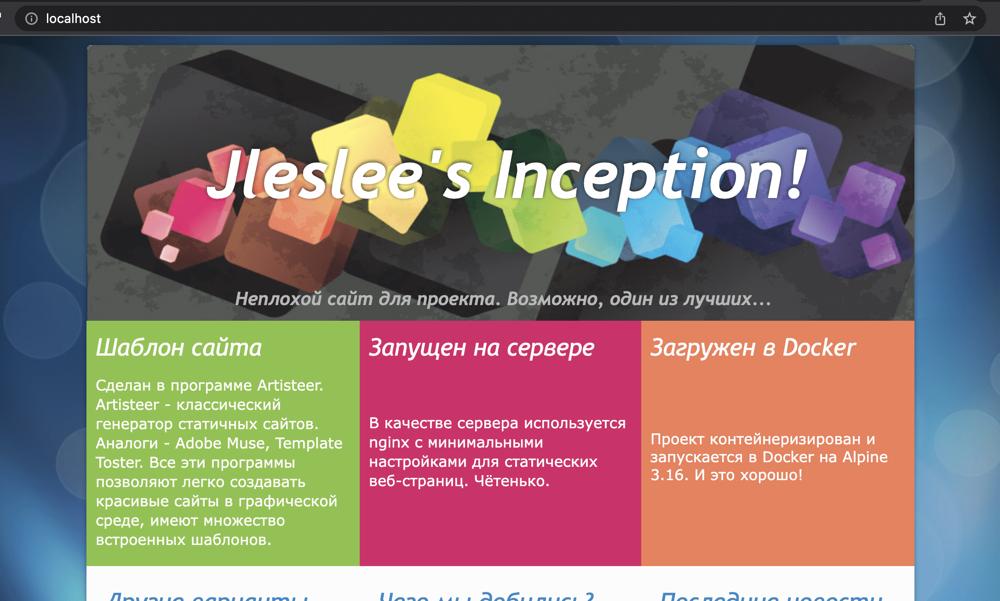
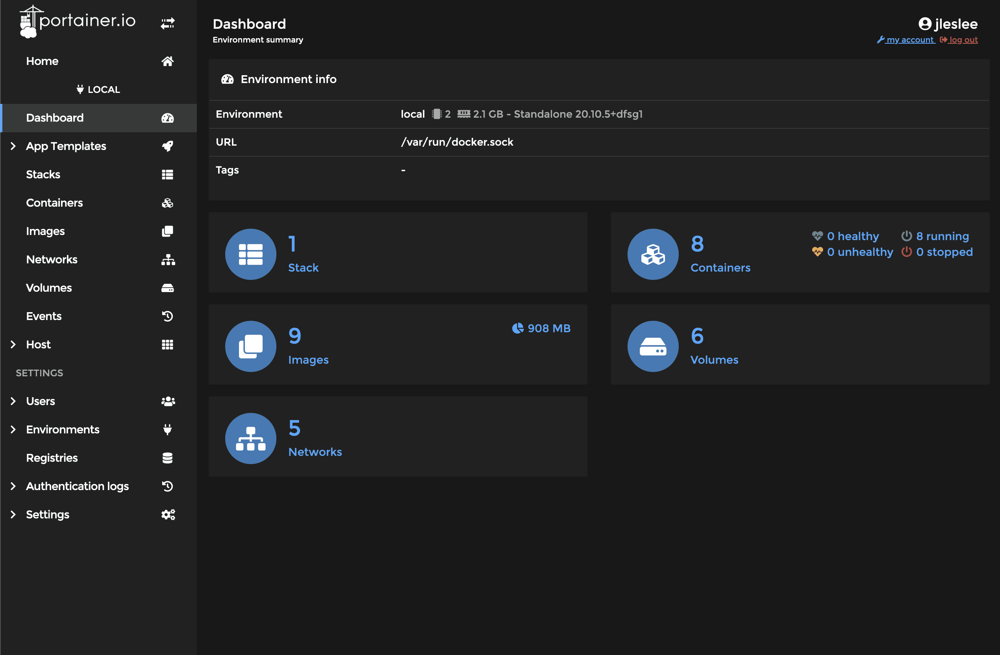

# Self-made website and portainer installation

## Step 1. Self-made website

According to the assignment, we have to create a self-written website using the technology that is closer to us. Here, everyone chooses for themselves which language to use and which container to create. Those who like JS can use a container with nodejs and react, python lovers can create a page on django, etc. I didn't bother and used a ready-made solution for creating a page - a wysiwyg editor for generating static html.

The site itself is located in the `requirements/bonus/website/conf`, it can be opened directly in the browser, as it is html.

## Step 2. Dockerfile

We take the dockerfile from our nginx, since we will run the html site on the same nginx. We are changing the default config located at `/etc/nginx/http.d/default.conf`, putting a simple code there indicating a different location instead of the standard one (/var/www/html/):

```
FROM alpine:3.16
RUN	apk update && apk upgrade && apk add --no-cache nginx

RUN echo "server {" > /etc/nginx/http.d/default.conf && \
    echo "root    /var/www/html;" >> /etc/nginx/http.d/default.conf && \
    echo "location / {" >> /etc/nginx/http.d/default.conf && \
    echo "    try_files \$uri /index.html;" >> /etc/nginx/http.d/default.conf && \
    echo "}}" >> /etc/nginx/http.d/default.conf

COPY requirements/bonus/website/conf/* /var/www/html/

EXPOSE 80
CMD ["nginx", "-g", "daemon off;"]
```

We copy all the contents of the site using a mask * to our folder /var/www/html/. We open the 80th port (there is no need to scroll, the port is already open in the system). Well, we run nginx without demonization.

## Step 3. Section in docker-compose

Here we just take the same source data as wordpress, but delete everything unnecessary.

```
  website:
    build:
      context: .
      dockerfile: requirements/bonus/website/Dockerfile
    container_name: website
    ports:
      - "80:80"
    restart: always
```

Our port 80 is free, we will connect it to our website, without the need to roll out ssl.

## Step 4. Launching the website

If we have done everything correctly, go to the project folder and do `make re". After restarting the project, we switch to `http://localhost ` and we see the result:



As you can see, there is nothing complicated about this bonus item. But this particular point can be complicated indefinitely. Although, it is unlikely that there will be those who want to practice writing a website on ASP.NET as part of a school project. But in general, this is possible.

## Step 5. Portainer

The installation of portainer will differ from the installation of other containers in that portainer will not depend on our docker-compose, and on the contrary, all our containers will be managed through portainer.

This is a cool and very convenient utility with a graphical dashboard for managing containers, and soon you will regret that you got to know it so late, only at the end of the project. It would make it much easier for us to write inception, but we're not looking for easy ways, are we?

To install portainer, we will use the [official documentation](https://docs.portainer.io/v/ce-2.11/start/install/server/docker/linux "install portainer"). At the time of writing the inception project, the commands were as follows (if they change, focus on the official documentation, not on the project guide):

First, we will create a section for the portainer data.:

``docker volume create portainer_data``

Then download and install the portainer container via docker:

```
docker run -d -p 8000:8000 -p 9443:9443 --name portainer --restart=always -v /var/run/docker.sock:/var/run/docker.sock -v portainer_data:/data portainer/portainer-ce:2.11.1
```

We check on the official website page to see if the commands have changed, run the current ones, and after installation, check the portainer page.:

``https://localhost:9443``

We get the familiar warning about a self-signed certificate (yes, professional software uses them too!), ignore it and go to the page. First, we will be asked to come up with a password for the dashboard. You can also change the username. I entered everything that I had entered for wordpress and clicked "create user".

After I was redirected to the portainer page, I went to `https://localhost:9443 /#!/home` and saw our local docker configuration. Clicking on it took me to the management page.:



As we can see, in the end we have:

- 1 Stack (one docker-compose file)
- 8 Containers (7 project containers and the 8th container itself)
- 9 Images (alpine:3.16 is reused many times, therefore it is taken out in a separate way)
- 6 Sections (3 system sections for docker, wp-volume db-volume sections and portainer_data section)
- 5 Networks (3 system + default network of the project + our manually created inception network)

All this can be controlled directly from the portainer. You can also create new containers, change old ones, run entire docker-compose configurations - in general, manage our container zoo the way your heart desires. Portainer allows you to manage all the features of docker through a graphical interface.


But that's a completely different story...

## RESULTS

So, our task is completed, we have created everything we need for the assignment.

Hooray, Kazan, I've finished writing my guide!


Now you can give me a ~~plus sign in karma~~ a star in the git and hand over the inception with bonuses. A~~Dobby is free~~ I'm going to reward myself with lunch in the kind dining room (as an advertisement*).

And finally, some humor from GitHub.:


By the way, the JS libraries of the artisteer-generated website really take up the most code. So all this time we've been writing a JS project, and I congratulate us on that.
