nstalling Debian Linux in Virtualbox

## Step 1. Download

Go to the [official website](https://www.debian.org / "download debian") and download the web installer

## Step 2. Launch

### 2.1 Creating a virtual machine

Create a virtual machine. We call our project something (I just called it inception) and set the correct system configuration. If the project is being done on a 42 School device, its folder should be placed in sgoinfre:

### 2.2 Resources setting

RAM for the project can be allocated from 512MB (if your PC has 4 GB RAM) to 4096MB (if your device has 16GB or even more RAM). It is pointless to allocate more than 4 GB of memory for this project.

The format we choose is VDI or VHD:

Select a dynamic format and allocate 8 gigabytes for the disk.

Also, do not forget to set a convenient screen resolution (zoom level) if you are working on MAC (200% or 300% is usually fine for this):

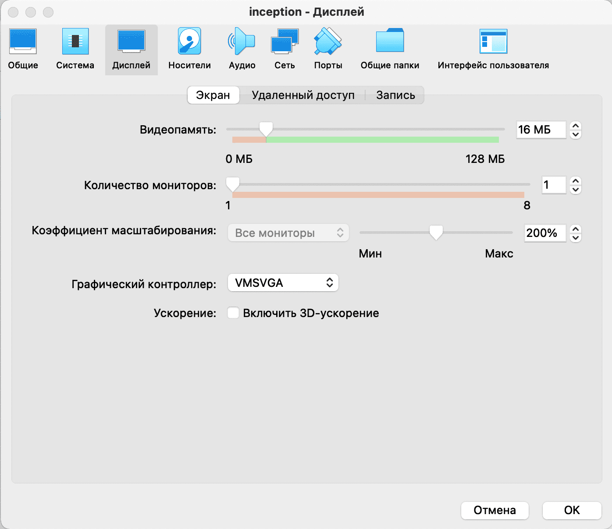

### 2.3 Allocation of processor resources

You can also add more cores to the system. Adding more than four is redundant, no need at all:

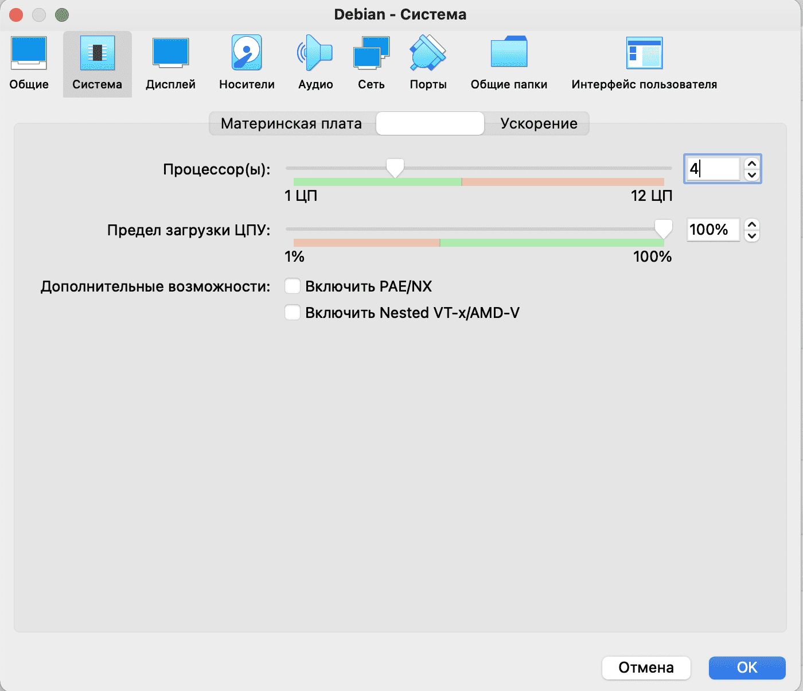

## Step 3. Installation

### 3.1 Start of installation

After all the settings, we launch our project. At the start, we are greeted by the installation menu. I choose a regular installer, but if desired, you can use a graphic one, it's a matter of taste.

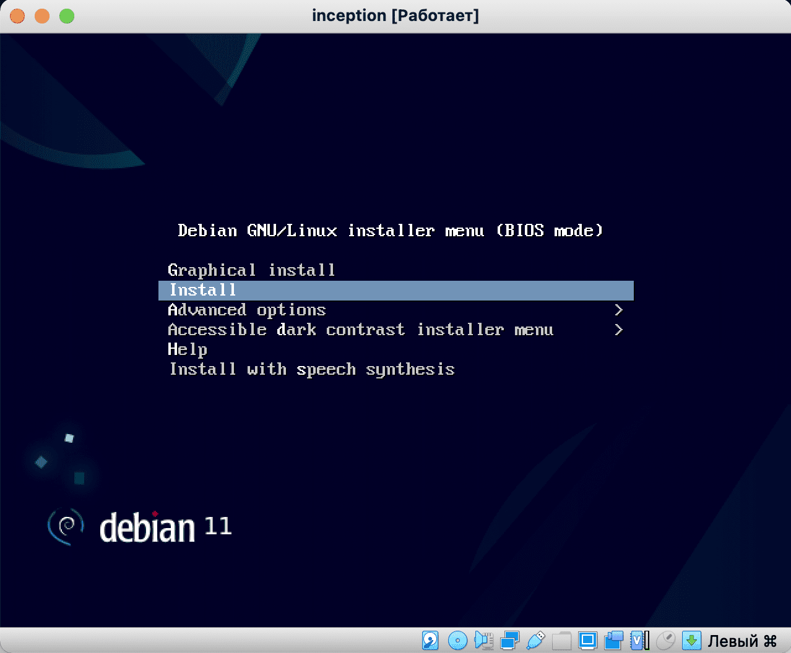

### 3.2 Language and location selection

We can choose any language, keyboard input and location, as we feel more comfortable:

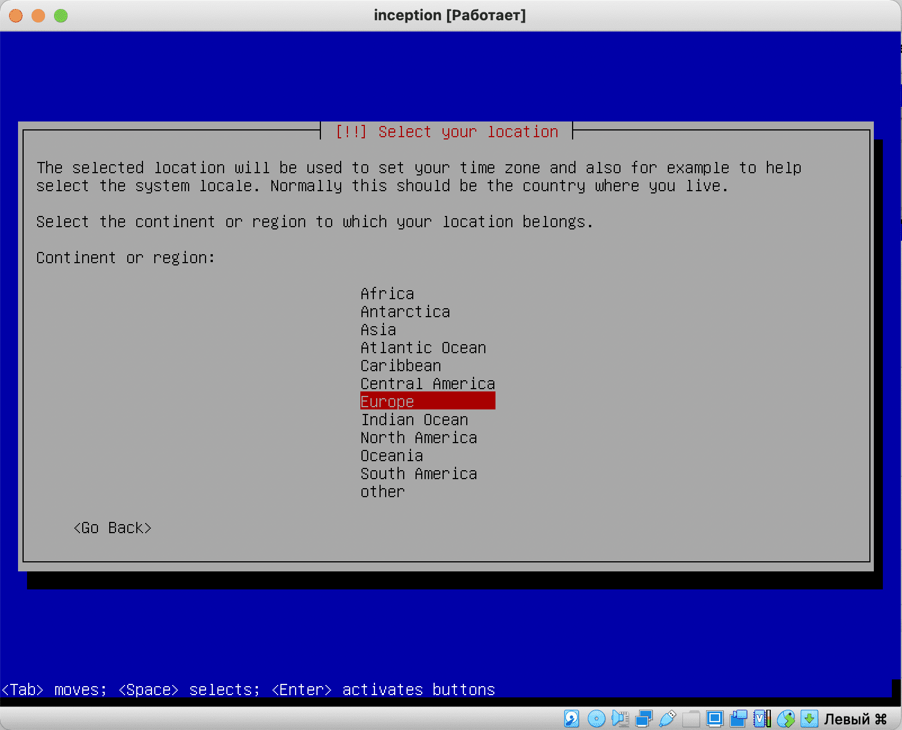

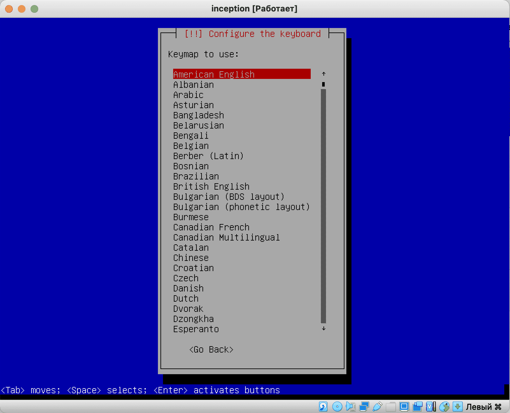

### 3.3 Configure host and users

Next, the system will prompt you to select a hostname. You can name the host inception, but I left the default name ``debian``:

We skip the domain name, leaving the line empty.

The system will prompt us to set the password of the superuser (root). I assign Root a simple password, the number `2`.

Next, we will be asked to name an ordinary user somehow. I enter my nickname in the intro:

I accept the same name as the account name and enter a simple password.

### 3.4 Setting up Time zones

Choose your time zone.

### 3.5 Disk Layout

Next, the markup program will start. We don't have to go into the details of the linux file system, so we choose ``use entire disk`` to use the entire disk.

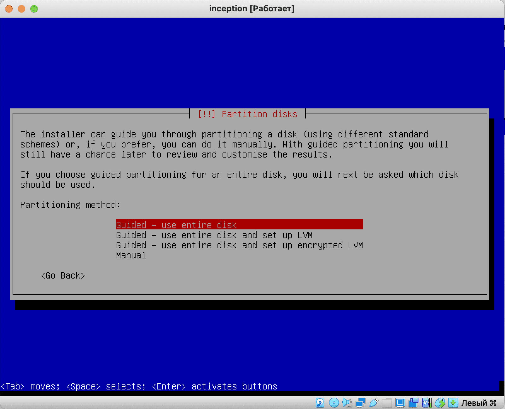

We select the only virtual disk available to us:

Choose to store all files in one partition.:

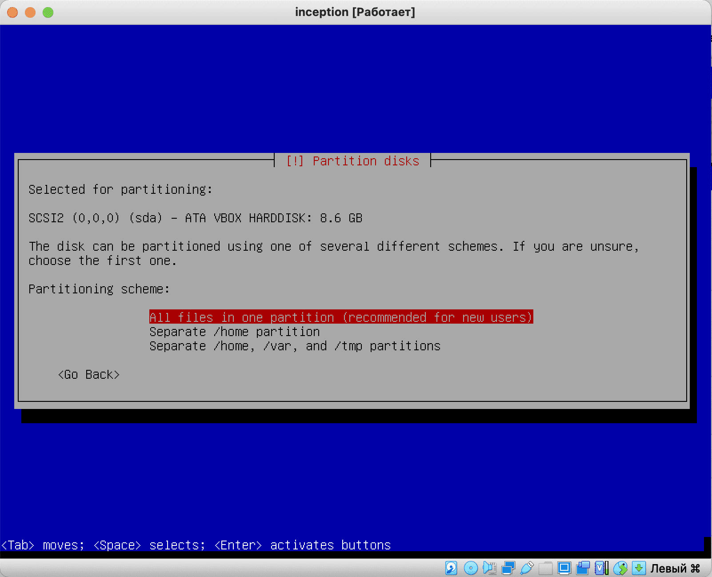

And we give the command to complete the markup and write the changes to disk.:

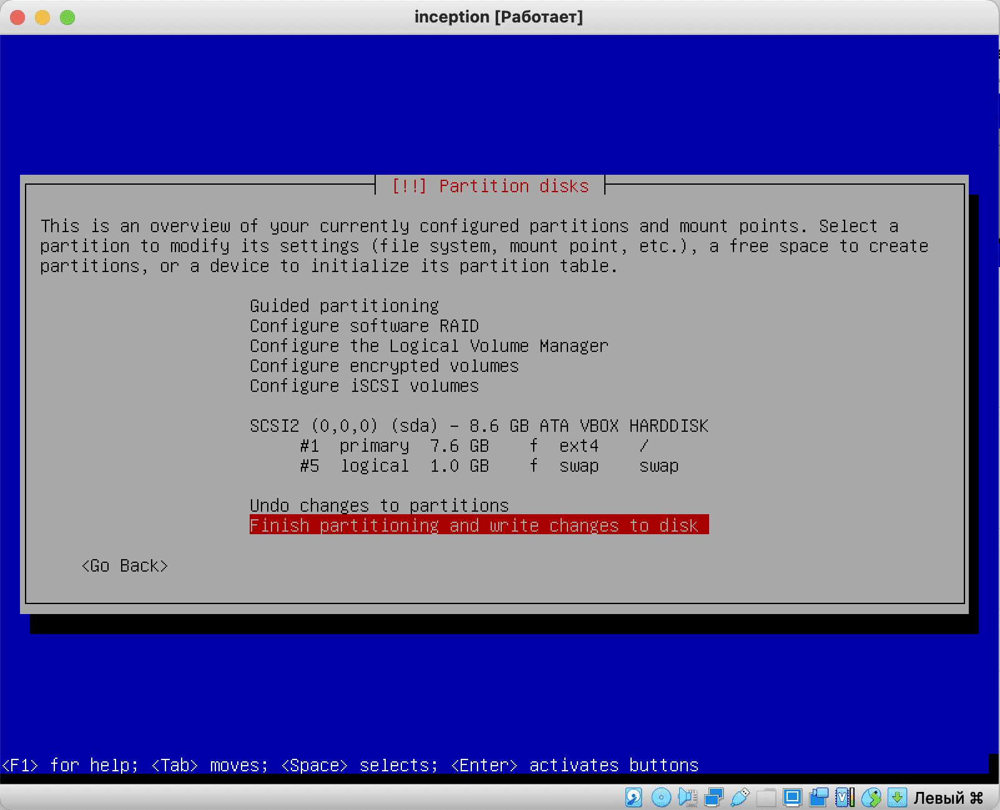

We confirm the seriousness of our intentions:

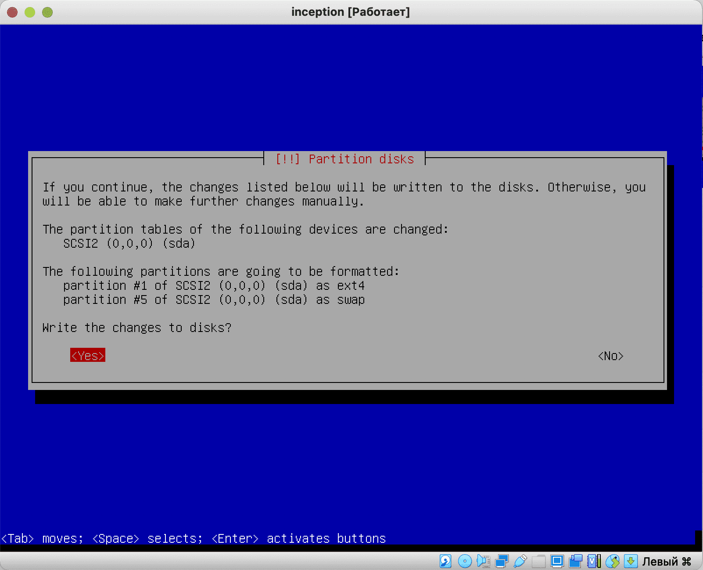

### 3.6 Installing the base system

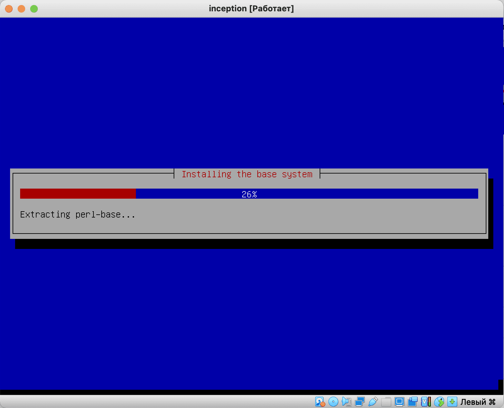

After the markup, the installation of the base system will start. Next, I will describe only those steps that are important to us, the rest of the steps can be skipped by pressing `enter`

We just skip all the extra stuff like an additional CD image, choosing repository mirrors, or polling the popularity of packages.

### 3.6.1 Software Selection

We only need an ssh server, so we use a space to uncheck everything else. Later, we will install a lighter openbox as a graphical environment. We will only need it to open our website. We also don't need system utilities.

### 3.6.1 Software Selection

Eventually, the system will finally tell us that it wants to install the system loader on the main partition.:

Select a section (we have only one):

And the installation is completed:

We accept the offer to finish the installation:

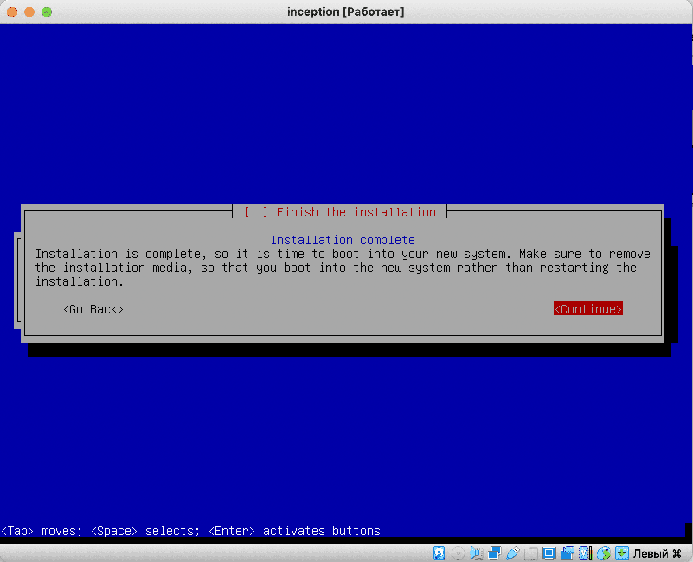

This is how our system is installed. Let's move on to the next guide and roll out all the software we need!