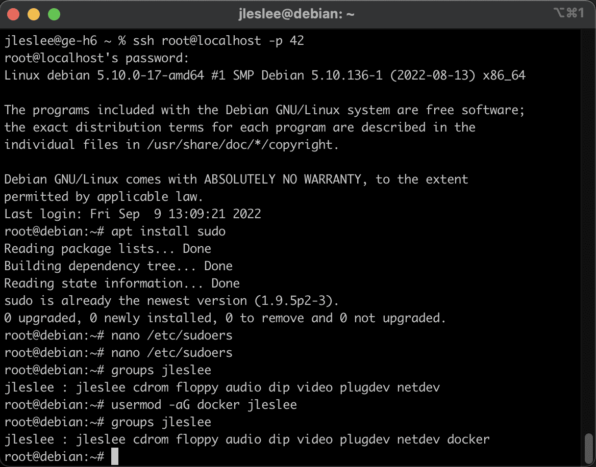
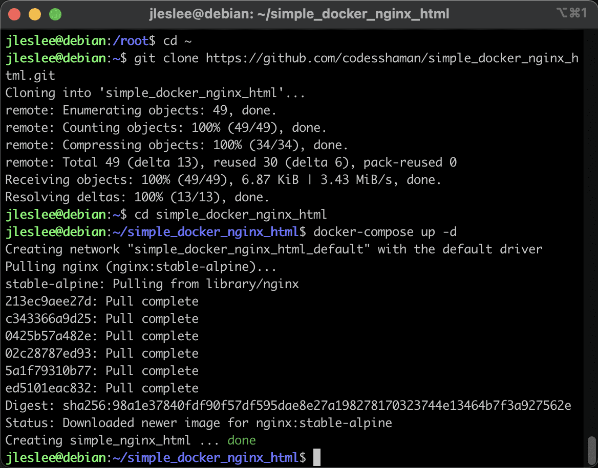

# Pre-configuring Docker

> Don't forget to take a snapshot of the status before each new stage of the build!

## Step 1. Installation and configuration of sudo

Now we need to start working with docker. First, let's make it convenient for us, as well as test its operation.

> It is better to perform all the actions of this guide through the terminal or the VSCode ssh remote extension, so that it is possible to copy-paste commands and code

By default, docker is run either with superuser privilege, or by any user in the docker group who has the ability to make requests under superuser (for example, via sudo). 

(Previously, we installed the sudo utility, which allows the user to make requests as root)

In order for our user to make such requests in the system, we edit the /etc/sudoers config.:

```nano /etc/sudoers```

Our task is to add an entry with our user name and rights equivalent to root rights.:


Save the changes and close the file.

## Step 2. Adding a user to the docker group

Now let's add our user to the ``docker`` group. This will allow us to execute docker commands without having to invoke sudo. (yes, we installed sudo not for docker, but for the convenience of working with the system).

This is what our user's group list looks like now.:

 ```groups <your_nickname>```


Let's add our user to the group with the command 

```sudo usermod -aG docker <your_nickname>```

And check that the addition has occurred.:

```groups <your_nickname>```



As we can see, the docker group has been added to the list of groups at the very end. This means that now we can call our docker from under a regular user

## Step 3. Test configuration

So let's switch to our user and go to his home directory.:

```su <your_nickname>```

```cd ~/```

We will also download a simple configuration from a single docker container to the root to check the operation of the system.:

```git clone https://github.com/codesshaman/simple_docker_nginx_html.git```


Now we can go to this folder and launch the container.:

```cd simple_docker_nginx_html```

```docker-compose up -d```

After a while, our container will crash and we will see a message about a successful launch.:



This means that we can test the running container and the correct configuration settings. Open the browser of the host machine to check it.

If we did everything correctly in step 02 during port forwarding, then port 80 is open, and by logging into the browser at the local host address ``http://127.0.0.1 `` (*exactly http, not https!*) we will see the following picture:


If suddenly we see something else, it means that our ports are not open or port 80 is busy with something on the host machine. Go through guide 01 and make sure that the ports are open, as well as check all running applications. If there are servers or other applications for working with the local host among them, disable them.

## Step 4. Create project directories and files

Next, we need to create many directories and files according to the task.

This is a routine task in which there is nothing complicated: the `mkdir` command creates a directory, the `touch` command creates a file, the `cd` command moves us along the relative or absolute path indicated after the command, and the `cd..`` takes us to the catalog above. Also, `pwd` shows where we are, `cd~" returns us to the home directory.

If you don't want to do this routine, the author of the original guide made a script: ``make_directories.sh`` , which performs all these actions automatically. If you want to use it, you should edit it in order to add your nickname or change any folder name if wanted.

``nano make_directories.sh``

Here is its code, in case you don't have the file you can just create one and copy this:

```
#!/bin/bash
mkdir project
mkdir project/srcs
touch project/Makefile
mkdir project/srcs/requirements
touch project/srcs/docker-compose.yml
touch project/srcs/.env
echo "DOMAIN_NAME=<your_nickname>.42.fr" > project/srcs/.env
echo "CERT_=./requirements/tools/<your_nickname>.42.fr.crt" >> project/srcs/.env
echo "KEY_=./requirements/tools/<your_nickname>.42.fr.key" >> project/srcs/.env
echo "DB_NAME=wordpress" >> project/srcs/.env
echo "DB_ROOT=rootpass" >> project/srcs/.env
echo "DB_USER=wpuser" >> project/srcs/.env
echo "DB_PASS=wppass" >> project/srcs/.env
mkdir project/srcs/requirements/bonus
mkdir project/srcs/requirements/mariadb
mkdir project/srcs/requirements/mariadb/conf
touch project/srcs/requirements/mariadb/conf/create_db.sh
mkdir project/srcs/requirements/mariadb/tools
echo "" > project/srcs/requirements/mariadb/tools/.gitkeep
touch project/srcs/requirements/mariadb/Dockerfile
touch project/srcs/requirements/mariadb/.dockerignore
echo ".git" > project/srcs/requirements/mariadb/.dockerignore
echo ".env" >> project/srcs/requirements/mariadb/.dockerignore
mkdir project/srcs/requirements/nginx
mkdir project/srcs/requirements/nginx/conf
touch project/srcs/requirements/nginx/conf/nginx.conf
mkdir project/srcs/requirements/nginx/tools
touch project/srcs/requirements/nginx/Dockerfile
echo ".git" > project/srcs/requirements/nginx/.dockerignore
echo ".env" >> project/srcs/requirements/nginx/.dockerignore
mkdir project/srcs/requirements/tools
mkdir project/srcs/requirements/wordpress
mkdir project/srcs/requirements/wordpress/conf
touch project/srcs/requirements/wordpress/conf/wp-config-create.sh
mkdir project/srcs/requirements/wordpress/tools
echo "" > project/srcs/requirements/wordpress/tools/.gitkeep
touch project/srcs/requirements/wordpress/Dockerfile
echo ".git" > project/srcs/requirements/wordpress/.dockerignore
echo ".env" >> project/srcs/requirements/wordpress/.dockerignore
```

> Don't forget to change <your_nickname> to your nickname!

In the tools directories of wordpress and mariadb, we create an empty file.gitkeep, which only serves to get these empty folders into git indexing. Without it, they will not be uploaded to the repository. We will not use these folders, since mariadb and wp will have only one configuration each. We will perform most of the simple operations directly in the dockerfile, eliminating the need for unnecessary files from the outside. (This will be explained better and, hopefully, understood later on)

To execute the script, it must be given permission:
`chmod +x make_directories.sh `


After that, you can run it.:

``./make_directories.sh``

And that's it, all the directories of our project (and even some necessary files in them) have been created!


